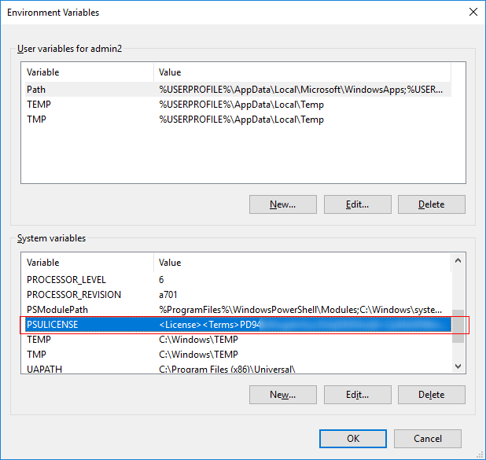

# Best Practices

## General

### Avoiding Writing to the Repository Directory


The repository directory defaults to `C:\ProgramData\UniversalAutomation\Repository`


Writing files directly to the repository directory in your scripts can have adverse side effects on performance of the system. PowerShell Universal employs a file system watcher to check for changes to files made on disk. Any changes made within the directory trigger the watcher and configuration file reload verification.&#x20;

In some instances, writing files can result in configuration reloads that may restart dashboards or cause internal caches to be cleared.&#x20;

It's recommended to avoid writing to this directory directly in a default configuration. If you would like to write to the directory, consider disabling the server-wide Auto Reload setting. This will disable the file system watcher and you will no longer risk impacting the configuration of the system.&#x20;

<figure><figcaption></figcaption></figure>

### Favor Non-Integrated Environments

While the integrated environment is fast and easy to use, it runs all of your PowerShell operations within the PowerShell Universal service. Issues with a single script or endpoint can affect the stability of the system.&#x20;

When using non-integrated environments, an external PowerShell process is started. For APIs and Dashboards, that process can be long running but can be restarted without affecting the rest of the system. With jobs and terminals, a new process is started for each instance of the job and terminal. As jobs and terminals are stopped, the process is terminated, and any resources consumed by that process are reclaimed by the system.&#x20;

Additionally, when loading modules into the integrated environment, the process space may become polluted with different versions of common DLLs that PSU may be using itself. This can cause assembly binding problems that may cause the imported modules to fail to function as expected.&#x20;

### Isolate Problematic Modules

Complex PowerShell modules can cause problems with PowerShell Universal. Certain modules are not designed to be hosted in a long running process like PowerShell Universal. You will want to use these modules in transient operations like jobs.&#x20;

For example, dbatools may leak database connections when used directly within PowerShell Universal's integrated environment. To avoid this, you can start an external process by running a PowerShell Universal job in a non-integrated environment. The script will run, the process will terminate, and the database connection will be reclaimed automatically.&#x20;

Below is a list of some modules we have experienced issues with.

* dbatools - Memory usage and leaked database connections
* PSFramework - Memory usage
* VMware PowerCLI - Connection management is scoped to the process
* Az - Connection management is scoped to the process

### Leverage Custom Modules

Building custom modules ensures that you can use the same functionality throughout the PowerShell Universal platform without duplicating code. You can use the same functions in APIs, scripts and dashboards without having to duplicate the logic.&#x20;

Reducing the amount of script an any of these places can help you to better test and isolate issues that are caused by integrating with the platform or by the module itself.&#x20;

Also consider building functions to wrap complex dashboard components. This reduces the overall complexity of the dashboard script and makes it easy to debug and read.&#x20;

### Set a Cache Lifetime

When using `Set-PSUCache`, ensure that you set some sort of lifetime to the cache. This is especially important if you have data that isn't being used all the time and is large in size. Data set into the cache without a lifetime is never returned to the system.&#x20;

For example, you can use the sliding expiration to expire cache data if it isn't used for some time for one hour.&#x20;

```powershell
Set-PSUCache -Key 'Data' -Value (Get-Date) -SlidingExpiration (New-Timespan -Hours 1)
```

## APIs

### Avoid Returning Highly Complex Objects

By default, API endpoints will serialize returned objects to JSON using `ConvertTo-Json`. Although the platform restricts the depth of the JSON, highly complex objects can cause the cmdlet to spin out of control and consume high amounts of CPU. PowerShell Universal will attempt to cancel this processing if it is detected but it will still cause issues with your API environment.&#x20;

Make sure you understand the complexity of the objects you are returning. If objects are too complex, consider using `Select-Object` to select a subset of the data returned. You can also call `ConvertTo-Json` yourself to control the `-Depth` parameter.&#x20;

An example of this would be returning Process objects with `Get-Process` . Due to the complexity of the Process type, it causes problems during serialization. Instead, select only a subset of the properties that are required.&#x20;

```powershell
Get-Process | Select-Object Name,Id
```

### Avoid Long Running Processes in APIs&#x20;

The HTTP thread pool is limited in size. Long running processes in APIs can cause the pool to become exhausted which can cause problems for the entire PowerShell Universal server. If you plan to have an API that takes more than a few seconds, consider having the API start a job. You can then create a second API to check the state of jobs returned by the first API. This will ensure that the operation continues to process but the HTTP thread pool reclaims the available connection.&#x20;

For example, you could have the following APIs. The first endpoint starts a job and returns the job ID. The second endpoint retrieves the pipeline output for the specified job.&#x20;

```powershell
New-PSUEndpoint -Url '/createReport' -Method POST -Endpoint {
    (Invoke-PSUScript -Name CreateReport.ps1 -Integrated)
}

New-PSUEndpoint -Url '/createReport/:id' -Method GET -Endpoint {
     Get-PSUJob -Id $Id -Integrated | Get-PSUJobPipelineOutput -Integrated
}
```

To call these endpoints, we could do the following with `Invoke-RestMethod`.&#x20;

```powershell
$Id = Invoke-RestMethod http://localhost:5000/createReport -Method POST
Start-Sleep 5
Invoke-RestMethod http://localhost:5000/createReport/$Id -Method GET
```

## Automation

### Reduce Unnecessary Job Output

While storing job output is useful for auditing, storing all job output can cause your storage to balloon in size which in turn will slow the performance of your PowerShell Universal system. Some steps you can take to keep job output in check are as follows.&#x20;

#### Discard Pipeline Output

If you aren't going to use pipeline output, you can instruct PowerShell Universal to discard it. This will reduce the amount of data stored as well as increase the performance of your jobs because the system doesn't need to serialize all output to for storage. You will still see your output streams in the job log.&#x20;

#### Take Advantage of Streams&#x20;

Using Debug, Warning and Error streams can help to reduce what is shown in the job by default. Setting the action preference per stream can allow you to disable certain streams for regular operations but enable streams when the job is experience problems.&#x20;

For example, if you use `Write-Debug` throughout your script, you can disable that via the `$DebugActionPreference` variable by setting it to `SilentlyContinue`. If the job were to start to experience problems, you could set it to `Continue` to view the output in the log.&#x20;

#### Utilize Out-Null

`Out-Null` can capture would-be pipeline output and discard it. If you don't want to discard all pipeline output, you can discard some of it by using `Out-Null`. This will improve performance and reduce the size of your job data.&#x20;

### Aggressively Groom Unimportant Jobs&#x20;

Some jobs, like a trigger that is used for notifications, may almost never been reviewed. Consider setting the job history very low in this case.&#x20;

## Dashboards

### Use Functions in Dashboards

When creating complex sections of a dashboard, it's advised to wrap it in a function to better organize and isolate that complex section. Highly nested dashboards are hard to debug and make it easy to introduce syntax errors that will affect the entire dashboard.&#x20;

We also recommend using modules to store your functions to further reduce the size and complexity of your core dashboard script. Additionally, modules can then be shared across dashboards.&#x20;

An example would be to wrap the logic of a table within a function and then use the function within the dashboard.&#x20;

```powershell
function New-ProcessTable {
    $Data = Get-Process
    $Columns = @( 
        New-UDTableColumn -Title 'Name' -Property 'Name'
        New-UDTableColumn -Title 'Id' -Property 'Id'
    )
    New-UDTable -Data $Data -Columns $Columns -ShowSearch
}

New-UDDashboard -Content {
    New-ProcessTable
}
```

### Consider Leveraging Jobs

Jobs are useful because they start an external process and can be used to audit interactions with the dashboard. Since dashboards are long running, certain operations and modules can begin to cause memory or other resource problems if used under load. Starting jobs ensures that the environment is reclaimed after each execution.&#x20;

Jobs make sense for operations that make changes (e.g. creating a VM or user), but their performance characteristics won't work for every scenario.&#x20;

An example would be calling a job from a form.&#x20;

```powershell
New-UDForm -Content {
   New-UDTextbox -Id 'UserName' -Label 'UserName'
} -OnSubmit {
   Invoke-PSUScript -Name 'CreateUser.ps1' -UserName $EventData.UserName -Environment PS7 -Integrated -Wait
   Show-UDToast "User $($EventData.UserName) was created!"
}
```

### Schedule Dashboard Restarts

If you are experience issues with dashboard resources, you can restart dashboards using a scheduled job that runs during non-business hours. You can use the `Get-PSUDashboard`, `Stop-PSUDashboard` and `Start-PSUDashboard` cmdlets to restart the individual dashboards. This technique is only valid when dashboards are running in non-integrated environments.&#x20;

### Be Aware of -Render Performance with New-UDTable

One feature of `New-UDTable` and`New-UDTableColumn`, is the ability to render columns to contain any component that you wish to display based on the row of data that you are providing to the table. This is usually useful for customizing the look and feel or by providing actions for the row's data. Rendering can become a performance issue if used incorrectly. Rendering many rows at once or using the render ScriptBlock to run long running processes will cause problems.&#x20;

#### Rendering Too Many Rows

If you are using the `-Data` parameter of `New-UDTable`, the `-Render` ScriptBlock will be called for each item you pass into the data parameter. If you have hundreds or thousands of items, this will cause page load times to increase.&#x20;

Consider using `-LoadData` to load and display only a page of data at a time. This only calls `-Render` for the displayed items and not the entire data set.&#x20;

#### Long Running Renders

Due to the implementation details of `-Render`, it's not suggested to use long running render operations. If you expect your `-Render` to take more than a few milliseconds, consider using `New-UDDynamic` to off load the render back to the server and display a loading skeleton. The server can efficiently schedule the rendering operation using the runspace pool in this case. &#x20;

An example of this is shown below.&#x20;

```powershell
$Data = @(
    @{Dessert = 'Frozen yoghurt'; Calories = 1; Fat = 6.0; Carbs = 24; Protein = 4.0 }
    @{Dessert = 'Ice cream sandwich'; Calories = 159; Fat = 6.0; Carbs = 24; Protein = 4.0 }
    @{Dessert = 'Eclair'; Calories = 159; Fat = 6.0; Carbs = 24; Protein = 4.0 }
    @{Dessert = 'Cupcake'; Calories = 159; Fat = 6.0; Carbs = 24; Protein = 4.0 }
    @{Dessert = 'Gingerbread'; Calories = 200; Fat = 6.0; Carbs = 24; Protein = 4.0 }
) 

$Columns = @(
    New-UDTableColumn -Property Dessert -Title Dessert -Render { 
        New-UDDynamic -Content {
            Start-Sleep (Get-Random -Min 1 -Max 5)
            New-UDButton -Text "Click for Dessert!" -OnClick { Show-UDToast -Message $EventData.Dessert } -Variant 'text'
        } -LoadingComponent {
            New-UDSkeleton
        }
    }
    New-UDTableColumn -Property Calories -Title Calories 
    New-UDTableColumn -Property Fat -Title Fat 
    New-UDTableColumn -Property Carbs -Title Carbs 
    New-UDTableColumn -Property Protein -Title Protein 
)
```

The result is a table that loads immediately but displays loading skeletons in the slow-to-render columns.&#x20;

<figure><figcaption></figcaption></figure>
