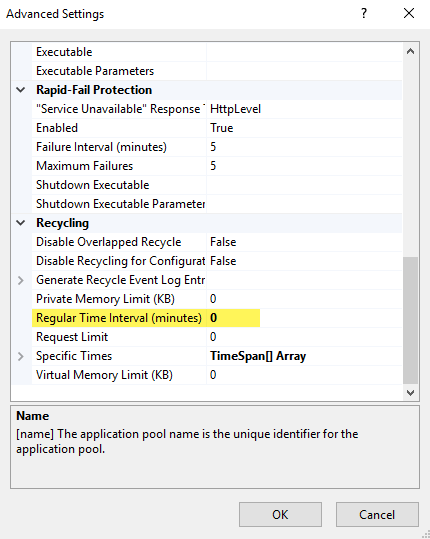
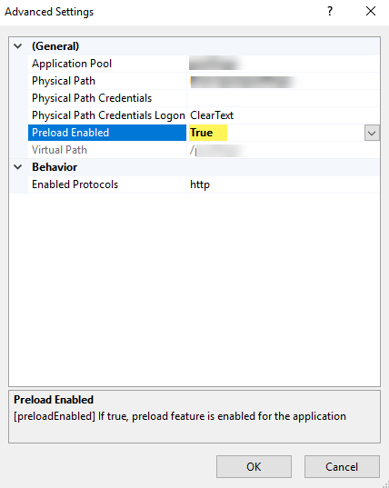

# IIS

## Hosting in IIS

PowerShell Universal supports being hosted in IIS (Internet Information Services (IIS) for Windows® Server). Please note that a series of host prerequisites and specific configuration steps are required to facilitate running PowerShell universal on IIS. Please review each section carefully as IIS requires many specific configuration settings applied to work with modern .NET Core applications such as PowerShell Universal.

## Step 1 : Preparing the IIS Host

The following components are required in order to host PowerShell Universal on IIS.

* [Internet Information Services (IIS) Version 10.0](https://docs.microsoft.com/en-us/iis/get-started/whats-new-in-iis-10-version-1709/new-features-introduced-in-iis-10-1709)
  * Including: WebSocket Protocol
* [ASP.NET Core Hosting Bundle 8.0](https://dotnet.microsoft.com/en-us/download/dotnet/8.0)

<figure><figcaption><p>Figure highlights the download link for the ASP.NET Core Hosting Bundle</p></figcaption></figure>

The following Windows Server IIS features are also required to be enabled on the IIS Host:

| Feature Display Name   | Requirement                               | Installation Script                       |
| ---------------------- | ----------------------------------------- | ----------------------------------------- |
| WebSocket Protocol     | Required to run PowerShell Universal      | `Install-WindowsFeature Web-WebSockets`   |
| Windows Authentication | Required for using Windows Authentication | `Install-WindowsFeature Web-Windows-Auth` |

First make sure to enable the IIS feature on Windows Server and then install the ASP.NET Core hosting bundle.

**NOTE**: IIS often requires a host reboot after installing the .NET Core Hosting bundle! It is strongly recommended that you REBOOT the IIS host after installing the .NET Core Hosting bundle.

Once these prerequisites are met, you are ready to begin configuration of PowerShell Universal on IIS.


Enabling the IIS WebDav Publishing feature will cause issues with Universal. WebDav Publishing filters HTTP requests and prevents PUT and DELETE verbs by default. If you have WebDav Publishing enabled, please ensure you have it configured properly to allow these verbs.


## Step 2 : Download PowerShell Universal

Download the Latest copy of PowerShell Universal. You will need to download the **ZIP** Archive version of PowerShell Universal. This archive is specifically built for those wishing to configure PowerShell Universal for IIS or other third party web servers. Extract the contents of the Zip to the intended web host folder location on your IIS Host.

You must ensure that the PowerShell Universal application files are unblocked after extracting them. You can unblock them with the `Unblock-File` cmdlet.

```
Get-ChildItem C:\inetpub\wwwroot -Recurse | Unblock-File
```


This location is very important and will be referenced throughout this document. Most importantly this location must be accessible by the Identity used by the IIS Application Pool.


## Step 3 : IIS Application Pool Configuration

Now that our Host is ready and we have downloaded PowerShell Universal, we can begin configuring IIS.

The first step in the IIS configuration process is to create a new Application Pool in IIS. Before we begin the configuration we should ensure that we select a valid identity for the IIS Application Pool.

### 3.1 : Choosing an App Pool Identity

The Application Pool Identity is crucial for PowerShell Universal as this will be the "default user" that jobs and apps (formerly known as dashboards) will run as. It will also be the user that will perform read/write operations to the Universal Automation database and will be used by IIS to read the web content directory and execute the application.

.png>)

It is suggested to use "**LocalSystem"** or a **Service Account** of your choosing.

Due to limitations in IIS, the Application Pool Identity settings have **MAJOR** consequences on the behavior for "**Run As**" options when using Universal Automation.


**IIS Limitations with Universal Automation**

* **App Service configured as Local System** - Scripts will execute as the System Account by default and a _Run as Accounts **CAN**_ be specified when executing a Script in Universal Automation
* **App Service configured as a Service Account** - Scripts can **ONLY** be executed with the Service Account and a **\*\***_**Run as Account**_ \_\*\*\_CANNOT\*\* be specified when executing scripts.


**Service Account Identity Requirements**

* [ ] Full Read/Write access the PowerShell Universal Application Folder we extracted in **Step 2**
* [ ] Full Read/Write access to the PowerShell Universal Database : Default: _C:\ProgramData\Universal Automation_
* [ ] _Log on as a batch job_ rights (e.g. from secpol.msc > Local Policies > User Rights Assignment


The Default Database location can be customized via the PowerShell Universal `appsettings.json` file if desired.


Once we have selected a valid identity we are ready to create the Application Pool in IIS.

### 3.2 : Creating the New IIS Application Pool

Now that we have chosen an App Pool identity that has read/write access to the PowerShell Universal Application and Database folders we can create the Application Pool in IIS.

* In IIs Manager, Choose the option to **Add Application Pool...**
  * **Name:** Use any Name you would like for the Application Pool
  * **.NET CLR Version**: No managed code
  * .png>)
  * Click **OK** create the Application Pool.

### 3.3 : Configure the "Advanced Settings" of the IIS Application Pool

Now that the Application Pool has been created, we will need to configure the **Advanced Settings**

* Open the "**Advanced Settings"** for the Application Pool and apply the following Configurations:
  * **General / Enable 32-Bit Applications**: False
  * **Process Model / Identity**: Use the Identity we selected for our Application Pool in the "Choosing an App Pool Identity" section above.
  * **Process Model / Load User Profile**: True

Once the Advanced Settings have been applied, our Application Pool is ready, our next step will be to configure the IIS Web Site that will utilize this Application Pool.

## Step 4 : IIS Web Site Configuration

### 4.1 : Prepping the web.config for our Website

Now that we have a valid Application Pool we need to create an IIS website to expose the application. Before we do this we will want to review the PowerShell Universal `web.config` file for our website. Within the extracted PowerShell Universal Application folder, we will find a web.config file. This configuration file has been specifically designed for IIS and has a number of configurations we need to review prior to creating the IIS Website.

Most Importantly we will need to update "**processPath**" argument value of this configuration file. This value will provide IIS with the exact path of the application binary so that it can properly launch the application.

* Open the web.config file in the PowerShell Universal Application Folder
  * Locate the **\<aspNetCore** **processPath** section of the configuration file
  * Change the processPath argument from ".\Universal.Server.exe" to be the exact location of the Universal.Server.exe path (see figure below for example)
  * Save the file to apply the configuration

```markup
<?xml version="1.0" encoding="utf-8"?>
<configuration>
  <system.webServer>
    <handlers>
      <add name="aspNetCore" path="*" verb="*" modules="AspNetCoreModuleV2" resourceType="Unspecified" />
    </handlers>
    <aspNetCore processPath="C:\Program Files (x86)\Universal\Universal.Server.exe" arguments="" forwardWindowsAuthToken="false" stdoutLogEnabled="true" stdoutLogFile=".\logs\log" hostingModel="InProcess"/>
  </system.webServer>
</configuration>
```


There are a variety of additional configurations in this file. We'll be reviewing these in more detail in the "Advanced Configuration" Section but you can refer to the "**Additional web.config configurations**" on this page for more details


### 4.2 : Creating the IIS Website for IIS

Now that an Application Pool has been created for PowerShell Universal with a valid Identity and we have configured the web.config file, we are finally ready to create the IIS Website. The Website component of IIS loads the application artifacts and exposes the application on the configured web endpoint.

1. In the IIS Manager: Click "Add Website.."
2. Configure the new website options :
   * **Site Name**: Use any name you would like, ex: `PowerShell Universal.`
   * **Application Pool**: **DO NOT** use the _DefaultAppPool_ - **Select** the Application Pool we created in our previous step.
   * **Physical Path**: This must be the physical path to the PowerShell Universal Content we extracted from our download .zip file. **NOTE**: The AppPool identity must have access to the location.
   * **Binding Settings**: Note, for initial configuration is suggested to use the base defaults, we'll update these later in our advanced configuration
     * Type http - For Initial Configuration
     * IP Address: All Unassigned
     * Port: 80
     * Host Name: Name of the Host

## Step 5 : Starting Website

At this point, all the required configurations should be in place, and the IIS website hosting PowerShell Universal should be up and running. With a web browser - browse to the configured website location to validate that PowerShell Universal has started. From here you can follow the "Getting Started" guide to validate base functionality. Once you are sure that the Application is working properly with a Basic IIS configuration you can proceed to the "Advanced Configuration" to secure and finalize your desired IIS Configuration.


If you are are still experiencing issues with the basic IIS Configuration try checking the "Logs" path specified in the web.config for common issues. If you are still experiencing issues reach out on the forums or support for assistance.


## Nested IIS Applications

It is possible to nest multiple PowerShell Universal instances under a single application pool and website, but it does require some additional configuration.

You will need have two folders for your application files: one for each application. You will also need to setup two data folders: one for each application.

<figure><figcaption><p>Web Site Root</p></figcaption></figure>

<figure><figcaption><p>Application Files</p></figcaption></figure>

<figure><figcaption><p>Data Files</p></figcaption></figure>

Once you have setup your folder structure configured, you will need to create two appsettings.json files and update your web.config files for each application.

Within the appsettings.json files, you will need to set the proper paths to the data files for each instance. You will also need to configure the correct base URL for the nested site.

```json
{
  "Kestrel": {
    "BasePath": "/psu1"
  },
  "Logging": {
    "Path": "C:\\src\\psu\\data1\\log.txt",
  },
  "Data": {
    "RepositoryPath": "C:\\src\\psu\\data1\\Repository",
    "ConnectionString": "filename=C:\\src\\psu\\data1\\database.db;upgrade=true",
  }
}
```

Next, you'll need to update the web.config files for each site to use the proper appsettings.json file and use OutOfProcess hosting.

```markup
<?xml version="1.0" encoding="utf-8"?>
<configuration>
  <system.webServer>
    <handlers>
      <add name="aspNetCore" path="*" verb="*" modules="AspNetCoreModuleV2" resourceType="Unspecified" />
    </handlers>
    <aspNetCore processPath=".\Universal.Server.exe" arguments="--appsettings C:\src\psu\appsettings.psu1.json" forwardWindowsAuthToken="false" stdoutLogEnabled="true" stdoutLogFile=".\logs\log" hostingModel="OutOfProcess" />
  </system.webServer>
</configuration>
<!--ProjectGuid: 588ACF2E-9AE5-4DF1-BC42-BCE16A4C4EDE-->
```

Now, within the IIS Manager, right click on the psu1 and psu2 folders to convert them to applications.

You should now be able to access the PowerShell Universal admin console at both of the following URLs.

```
http://localhost/psu1/admin
http://localhost/psu2/admin
```

## Configuration for Jobs


Misconfigured app pool settings can cause jobs to fail to run. The primary cause is app pool recycling or a failure to start the web app when the server is started. This is not an issue for features like APIs or Apps (formerly known as Dashboards) but due to the background processing of jobs, you will need to ensure the server starts the website and keeps it running. You can [learn more here](https://docs.hangfire.io/en/latest/deployment-to-production/making-aspnet-app-always-running.html#making-asp-net-core-application-always-running-on-iis).


If you are going to be running scheduled jobs within your PowerShell Universal instance hosted in IIS, you must make sure to configure IIS appropriately. There are several settings to validate when configuring your application pool.

### Application Initialization

Install the Application Initialization feature of the Web Server Role.

<figure><figcaption></figcaption></figure>

### App Pool Settings

You will want to configure the following settings:

* **General**: .NET CLR version = [No Managed Code](https://learn.microsoft.com/en-us/aspnet/core/host-and-deploy/iis/advanced?view=aspnetcore-7.0#sub-applications).
* **General**: Start Mode = AlwaysRunning
* **Process Model**: Idle Time-out setting = 0 (disabled)
* **Recycling**: Regular Time Interval = 0.

<figure><figcaption></figcaption></figure>

<figure><figcaption></figcaption></figure>

### Website Settings

Within the IIS Site that is hosting Universal, you will need to ensure that Preload is enabled.

<figure><figcaption></figcaption></figure>

### Environment Variables

While we attempt to detect that PSU is running within IIS, you may run into problems with the negotiate authentication handler being enabled when it's not supported in IIS. To ensure this is not a problem, you can completely disable it by creating the below environment variable on your IIS machine.

```powershell
$Env:PSU_DISABLE_WIN_AUTH = true
```

### Debugging Issues with IIS and Jobs

If you are still having issues with IIS and jobs, you should consider turning on[ IIS recycle logging](https://blogs.iis.net/ganekar/iis-7-0-application-pool-recycles-log-a-event-in-windows-event-log) to ensure that IIS is keeping your site running.

As of PowerShell Universal 3.3, you can (via the uptime of the system on the home page of the admin console) get a good indicator of the last time the service was started.

Prior to version 3.3, you can view the server uptime by visiting the [Hangfire](../../development/hangfire.md) dashboard and clicking the Servers tab.

## Authentication

PowerShell Universal can use anonymous authentication and Windows Authentication in IIS.

### Windows Authentication

To enable Windows Authentication, you will first need to enable it for your Web Server and then for your website. You can find the authentication settings under the Authentication section in IIS Manager.

.png>)

For the website, set the same settings.

.png>)

Once authentication is enabled in IIS, you will have to ensure that Windows Authentication is enabled for PowerShell Universal.

First, adjust the `web.config` file to forward the Windows authentication token.

```markup
<?xml version="1.0" encoding="utf-8"?>
<configuration>
  <system.webServer>
    <handlers>
      <add name="aspNetCore" path="*" verb="*" modules="AspNetCoreModuleV2" resourceType="Unspecified" />
    </handlers>
    <aspNetCore processPath=".\Universal.Server.exe" arguments="" forwardWindowsAuthToken="true" stdoutLogEnabled="true" stdoutLogFile=".\logs\log" hostingModel="OutOfProcess" />
  </system.webServer>
</configuration>
<!--ProjectGuid: 588ACF2E-9AE5-4DF1-BC42-BCE16A4C4EDE-->
```

Next, enable Windows Authentication in the `appsettings.json` file for PowerShell Universal.

```javascript
    "Authentication" : {
    "Windows": {
      "Enabled": "true"
    },
  }
```

Restart your Application Pool and now you should be able to login with Windows credentials.


When enabling Windows Authentication but not Anonymous Authentication, you will no longer be able to use PowerShell Universal AppTokens. You will need to enable both authentication methods to support Windows Credentials as well as App Tokens.


### Anonymous Authentication

Anonymous Authentication can be enabled to allow for app tokens and other requests to be transmitted through the IIS proxy. You will need to enable Anonymous Authentication on both the Server and Web site levels. There is no additional configuration to do within PowerShell Universal.

## Additional web.config configurations

The settings within the Universal web.config can be adjusted as you see fit. Below you will find a description of each setting.

### ForwardWindowsAuthToken

This setting is used for Windows Authentication. If you wish to use Windows Authentication with IIS, ensure that you disable Anonymous Authentication and enable Windows Authentication within your IIS site and then set this setting to true.

### StdoutLogEnabled and StdoutLogFile

This setting is used for debugging start up issues with your Universal setup. It's recommended to enable this when first configuring IIS integration. You can disable it once everything is configured. You need to ensure that your AppPool identity has write access to the StdOutLogFile location.

### HostingModel

The hosting model sets how the Universal server will run. When set to InProcess, the Universal Server will run from within the IIS agent. This provides better performance than using OutOfProcess hosting. InProcess hosting does not work with StdOutLogEnabled. It's recommended to use OutOfProcess hosting only while configuring Universal and, InProcess when your configuration steps have been completed.

## Upgrading

When upgrading, ensure that you do not copy (overwrite) files over the top of your existing install. Instead, (with the exception of web.config and \*.json files) delete all of the current application files and copy the new ones into the directory. **Copying over the top of the application files can result in binaries being present in the installation directory that are not expected and can cause issues with PowerShell Universal.**

<figure><figcaption><p>figure shows a prompt that you should not see when upgrading your IIS PSU</p></figcaption></figure>
