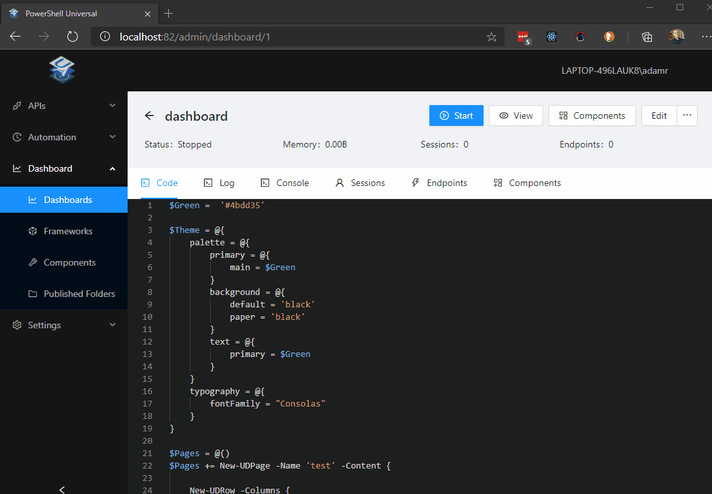

# Components

A Universal Dashboard website is composed of components. There are two frameworks that provide a set of core components that you can use within your pages. In addition to the core component, you can also extend Universal Dashboard with a large set of community created components.

There are two non-framework components that are built in to PSU. These include the Nivo charts library as well as the UDMap component. They will work in either framework. Additional components can be downloaded from the [UD Marketplace](https://marketplace.universaldashboard.io/).

External components are distributed as PowerShell modules and can be used in a dashboard by using `Import-Module`.

When building a dashboard, you can simply call the PowerShell cmdlets within your dashboard script to create a new component.

```text
New-UDDashboard -Title 'Dashboard' -Content {
    New-UDTypography -Text 'Hello, world!'
}
```

## Adding Components to Dashboards

Some components are not included automatically. You can add component modules by clicking the Components button on the Dashboard page and then adding the components. This list will also include components downloaded from the Marketplace.



