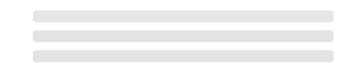

# Skeleton

A skeleton is a form of a loading component that can show a placeholder while data is received.

## Variants

There are three variants that you can use for a skeleton. You can use a circle, text or a rectangle. You can also define the height and width of the skeleton.

```text
New-UDSkeleton
New-UDSkeleton -Variant circle -Width 40 -Height 40
New-UDSkeleton -Variant rect -Width 210 -Height 118
```


## Animations

Skeletons will use the pulsate animation by default. You can also disable animation or use a wave animation.

```text
New-UDSkeleton
New-UDSkeleton -Animation disabled
New-UDSkeleton -Animation wave
```



