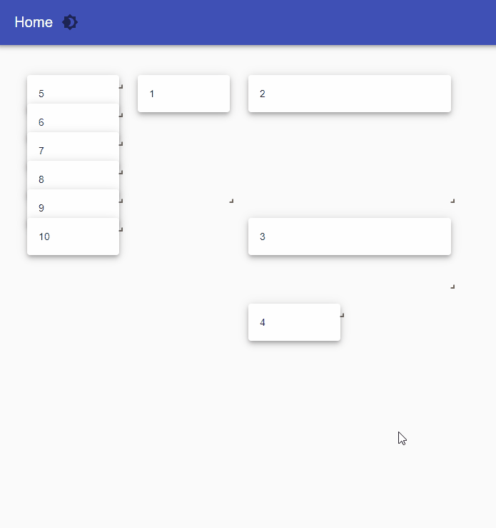

# Grid Layout

## Grid Layout


This component is available on the Universal Dashboard Marketplace


The Grid Layout component is useful for defining layouts in a visual manner. You can drag and drop components using the web interface to automatically define the layout as JSON.



## Installation

```text
Install-Module UniversalDashboard.GridLayout
```

## Designing Layouts

You can employ the -Design parameter to configure the layout of yourr page. This allows dynamic drag and drop of components that you place within the content of the grid layout. As you drag and resize components, the layout will be copied to your clipboard. Note: All components must possess a statid -Id

```text
New-UDGridLayout -Content { 1..10 | ForEach-Object { New-UDPaper -Id "Paper$" -Content { New-UDTypography -Text $ } -Elevation 5 } } -Design
```


## Using Layouts

Once you have configured the layout to fit your needs, you can paste the JSON into your script and assign it with the -Layout parameter. Remove the -Design parameter to lock elements in place.

```text
$Layout = '{"lg":[{"w":7,"h":7,"x":5,"y":0,"i":"grid-element-Paper1","moved":false,"static":false},{"w":7,"h":5,"x":5,"y":7,"i":"grid-element-Paper2","moved":false,"static":false},{"w":1,"h":1,"x":0,"y":0,"i":"grid-element-Paper3","moved":false,"static":false},{"w":1,"h":1,"x":0,"y":1,"i":"grid-element-Paper4","moved":false,"static":false},{"w":1,"h":1,"x":0,"y":2,"i":"grid-element-Paper5","moved":false,"static":false},{"w":1,"h":1,"x":0,"y":3,"i":"grid-element-Paper6","moved":false,"static":false},{"w":1,"h":1,"x":0,"y":4,"i":"grid-element-Paper7","moved":false,"static":false},{"w":1,"h":1,"x":0,"y":5,"i":"grid-element-Paper8","moved":false,"static":false},{"w":1,"h":1,"x":0,"y":6,"i":"grid-element-Paper9","moved":false,"static":false},{"w":1,"h":1,"x":0,"y":7,"i":"grid-element-Paper10","moved":false,"static":false}]}' 
New-UDGridLayout -Content { 1..10 | ForEach-Object { New-UDPaper -Id "Paper$" -Content { New-UDTypography -Text $ } -Elevation 5 } } -Layout $Layout
```


## Allowing Users to Modify Layouts

You can allow your users to dynamically modify layouts by using the -Draggable, -Resizable and -Persist parameters. The layout changes are stored locally so the next time each user visits a page, it will be loaded with their chosen layout.

```text
New-UDGridLayout -Content { 1..10 | ForEach-Object { New-UDPaper -Id "Paper$" -Content { New-UDTypography -Text $ } -Elevation 5 } } -Draggable -Resizable -Persist
```

