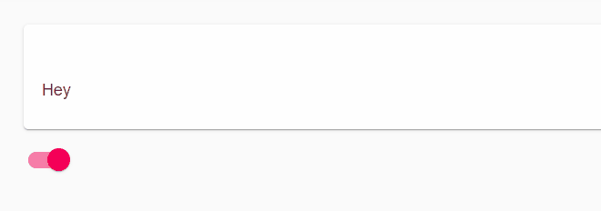
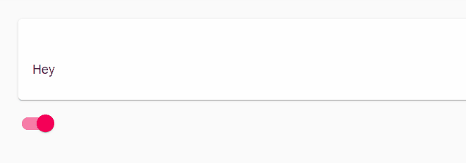

# Transitions

Transitions allow you to transition components in and out of view within your dashboard using various animations. You can take advantage of interactive cmdlets like `Set-UDElement` to change the transition state and cause an element to move in.

In the following example, we have a card that transitions in via a Fade. Clicking the switch the toggle the card in and out.

```text
New-UDTransition -Id 'test' -Content {
    New-UDCard -Text "Hey"
} -In -Fade -Timeout 1000

New-UDSwitch -OnChange {
    Set-UDElement -Id 'test' -Properties @{
        in = $EventData -eq 'True'
    }
} -Checked $true
```

The resulting effect looks like this.


## Collapse

The collapse transition will collapse a section in and out. You can specify a collapse height to only collapse a portion of the section.

```text
New-UDTransition -Id 'test' -Content {
    New-UDCard -Text "Hey"
} -In -Collapse -CollapseHeight 100 -Timeout 1000

New-UDSwitch -OnChange {
    Set-UDElement -Id 'test' -Properties @{
        in = $EventData -eq 'True'
    }
} -Checked $true
```



## Fade

A fade transition fades a component in and out as seen in the previous example. You can configure the timeout value to specify the number of seconds it takes to complete the transition.

```text
New-UDTransition -Id 'test' -Content {
    New-UDCard -Text "Hey"
} -In -Fade -Timeout 1000

New-UDSwitch -OnChange {
    Set-UDElement -Id 'test' -Properties @{
        in = $EventData -eq 'True'
    }
} -Checked $true
```

## Slide

The slide transition moves a component into position. You can determine the position of the slide by specifying the `-SlideDirection` parameter.

```text
New-UDTransition -Id 'test' -Content {
    New-UDCard -Text "Hey"
} -In -Slide -SlideDirection 'left' -Timeout 1000

New-UDSwitch -OnChange {
    Set-UDElement -Id 'test' -Properties @{
        in = $EventData -eq 'True'
    }
} -Checked $true
```



## Grow

The grow transition will fade and grow a component into place.

```text
New-UDTransition -Id 'test' -Content {
    New-UDCard -Text "Hey"
} -In -Grow -Timeout 1000

New-UDSwitch -OnChange {
    Set-UDElement -Id 'test' -Properties @{
        in = $EventData -eq 'True'
    }
} -Checked $true
```


## Zoom

The zoom transition will zoom a component into place.

```text
New-UDTransition -Id 'test' -Content {
    New-UDCard -Text "Hey"
} -In -Zoom -Timeout 1000

New-UDSwitch -OnChange {
    Set-UDElement -Id 'test' -Properties @{
        in = $EventData -eq 'True'
    }
} -Checked $true
```


