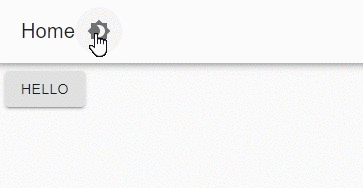

# Themes

Universal Dashboard v3 is built on Material UI. Material UI provides a [built-in theme system ](https://material-ui.com/customization/theming/)that UD now takes advantage of. You can utilize this theme system by providing a hashtable of options to the `New-UDDashboard` 's `-Theme` parameter. 

Here's an example of changing the theme's main color. 

```text
$Theme = @{
    palette = @{
        primary = @{
            main = '#111111'
        }
    }
}
New-UDDashboard -Theme $Theme -Title 'Hello' -Content {
    New-UDButton -Text "Test " -OnClick {
        Show-UDToast -Message 'HEllo'
    }
}
```

## Changing the background color

You can change the page background color by setting the background default color. To adjust the header background color, set the primary main color. 

```text
$Theme = @{
    palette = @{
        primary = @{
            main = '#876a38'
        }
        background = @{
            default = '#876a38'
        }
    }
#    typography = @{
#        fontSize = 20
#    }
}
New-UDDashboard -Theme $Theme -Title 'Hello' -Content {
    New-UDButton -Text 'Hello' 
}
```


## Supporting dark and light palettes

To support dark and light palettes, you can define a dark and light sections in your hashtable. They have the same properties as a theme.

```text
$Theme = @{
    light = @{
        palette = @{
            primary = @{
                main = "#fff"
            }
        }
    }
    dark = @{
        palette = @{
            primary = @{
                main = "#333"
            }
        }
    }
}
New-UDDashboard -Theme $Theme -Title 'Hello' -Content {
    New-UDButton -Text 'Hello' 
}
```



## Changing the font size

To change the font size, set the typography fontSize property. 

```text
$Theme = @{
    typography = @{
        fontSize = 20
    }
}
New-UDDashboard -Theme $Theme -Title 'Hello' -Content {
    New-UDButton -Text 'Hello' 
}
```


## Changing default button colors

```text
$Theme = @{
    palette = @{
        grey = @{
            '300' = '#000'
        }
    }
}
New-UDDashboard -Theme $Theme -Title 'Hello' -Content {
    New-UDButton -Text 'Small Button'
}
```


For a full list of options available for the theme system, you can look at the [default theme for Material UI](https://material-ui.com/customization/default-theme/).

