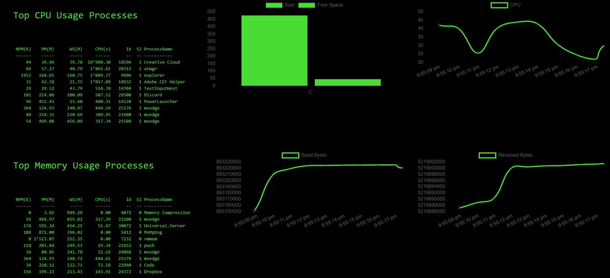

# Monitoring

## Retro Dashboard

This retro looking dashboard displays the top 10 CPU and memory using processes, disk usage, and live CPU and network usage. It also demonstrates how to use themes to custom the backcolor, text color and font family. 



```text
Start-PSUServer -Port 8080 -Configuration {
    New-PSUDashboard -Name 'Hacker Dash' -BaseUrl '/' -Framework 'UniversalDashboard:Latest' -Content {
    
    $Green =  '#4bdd35'
    
    $Theme = @{
        palette = @{
            primary = @{
                main = $Green
            }
            background = @{
                default = 'black'
                paper = 'black'
            }
            text = @{
                primary = $Green
            }
        }
        typography = @{
            fontFamily = "Consolas"
        }
    }
    
    $Pages = @()
    $Pages += New-UDPage -Name 'Hacker Dash' -Content {
    
        New-UDRow -Columns {
            New-UDColumn -LargeSize 4 -Content {
                    New-UDCard -Title 'Top CPU Usage Processes' -Content {
                        New-UDElement -Tag 'pre' -Content {
                            (Get-Process | Sort-Object -Property Cpu -Descending | Select-Object -First 10 | Out-String)
                        }
                    } 
                
            }
            New-UDColumn -LargeSize 4 -Content {
                $Data = Get-CimInstance -Class CIM_LogicalDisk | Select-Object @{Name="Size";Expression={$_.size/1gb}}, @{Name="FreeSpace";Expression={$_.freespace/1gb}}, @{Name="Free (%)";Expression={"{0,6:P0}" -f(($_.freespace/1gb) / ($_.size/1gb))}}, DeviceID, DriveType | Where-Object DriveType -EQ '3'
            
                $SizeDs = New-UDChartJSDataset -DataProperty Size -Label Size -BackgroundColor $Green
                $MemoryDs = New-UDChartJSDataset -DataProperty FreeSpace -Label 'Free Space' -BackgroundColor $Green
                
    
                $Options = @{
                    Type = 'bar'
                    Data = $Data
                    Dataset = @($SizeDs, $MemoryDs)
                    LabelProperty = "DeviceId"
                }
                
                New-UDChartJS @Options
            }
            New-UDColumn -LargeSize 4 -Content {
                New-UDChartJSMonitor -LoadData {
                     Get-CimInstance Win32_Processor | Measure-Object -Property LoadPercentage -Average | Select -Expand Average | Out-UDChartJSMonitorData
                } -Labels "CPU" -ChartBackgroundColor 'black' -ChartBorderColor $Green -RefreshInterval 1
            }
        }
    
        New-UDRow -Columns {
            New-UDColumn -LargeSize 4 -Content {
                    New-UDCard -Title 'Top Memory Usage Processes' -Content {
                        New-UDElement -Tag 'pre' -Content {
                            (Get-Process | Sort-Object -Property WorkingSet64 -Descending | Select-Object -First 10 | Out-String)
                        }
                    } 
            }
            New-UDColumn -LargeSize 4 -Content {
                New-UDChartJSMonitor -LoadData {
                     (Get-NetAdapterStatistics -Name 'Wi-Fi').SentBytes | Out-UDChartJSMonitorData
                } -Labels "Send Bytes" -ChartBackgroundColor 'black' -ChartBorderColor $Green -RefreshInterval 1
            }
            New-UDColumn -LargeSize 4 -Content {
                New-UDChartJSMonitor -LoadData {
                     (Get-NetAdapterStatistics -Name 'Wi-Fi').ReceivedBytes | Out-UDChartJSMonitorData
                } -Labels "Received Bytes" -ChartBackgroundColor 'black' -ChartBorderColor $Green -RefreshInterval 1
            }
        }
    
    
    
    } 
    
    New-UDDashboard -Title "Hello, World!" -Pages $Pages -Theme $Theme
    }
}
```

## Windows Performance Counter Charts

This example uses [PowerShell Universal Dashboard](../dashboard/about.md).

In this example, we take advantage of Universal Dashboard scheduled endpoints, the in-memory cache and the UDMonitor component. We update the counter sets to use in the cache and load each of the counters' value in the set into an array to use in the dashboard. We then create a dashboard that dynamically creates UDMonitor charts within the page. Each monitor will update every 3 seconds with new data.

```text
Start-PSUServer -Port 8080 -Configuration {
    New-PSUDashboard -Name 'Performance' -BaseUrl '/' -Framework 'UniversalDashboard:Latest' -Content {

        $Schedule = New-UDEndpointSchedule -Every 5 -Second
        New-UDEndpoint -Schedule $Schedule -Endpoint {
            if (-not $Cache:CounterSets)
            {
                $Cache:CounterSets = Get-Counter -ListSet * | Select-Object -ExpandProperty 'CounterSetName'
                $Cache:CurrentSets = @( "IPv4")
            }
            
            $Cache:Data = @()
            foreach($set in $Cache:CurrentSets)
            {
                $Data = @{
                    Set = $set
                    Counters = @()
                }

                $Counters = (Get-Counter -ListSet $set).Paths
                foreach($Counter in $Counters)
                {
                    
                    $Value = 0 
                    try {
                        $Value = (Get-Counter -Counter $Counter -ErrorAction SilentlyContinue).CounterSamples[0].CookedValue
                    } catch {}
                    
                    $Data.Counters += @{ Name = $Counter; Value = $Value }
                }

                $Cache:Data += $Data
            }
        } | Out-Null

        New-UDDashboard -Title 'Performance' -Content {
            foreach($Data in $Cache:Data)
            {
                New-UDTypography -Text $Data.Set -Variant h4
                New-UDRow -Columns {
                    foreach($Counter in $Data.Counters)
                    {
                        New-UDColumn -Size 4 -LargeSize 3 -Content {
                            New-UDTypography -Text $Counter.Name
                            New-UDChartJSMonitor -LoadData {
                                $Set = $Cache:Data | Where-Object Set -eq $Data.Set
                                $Value = ($Set.Counters | Where-Object Name -eq $Counter.Name).Value
                                if (-not $Value)
                                {
                                    $Value = 0
                                }
                                $Value | Out-UDChartJSMonitorData
                            } -Labels "Value" -ChartBackgroundColor "#297741" -RefreshInterval 3 -DataPointHistory 10
                        } 
                    }
                }
            }
        }
    } -Component @("UniversalDashboard.Charts:1.3.0")
} 
```


