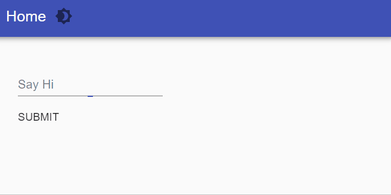

# Get Started

You can get up and running with PowerShell Universal by installing the `Universal` PowerShell Module. We've added some configuration for a REST API endpoint and Dashboard below. 

```csharp
# Storage location for the PowerShell Universal Server
$Path = Join-Path $Env:ProgramData "PowerShellUniversal"

# Install the Latest version of PowerShell Universal
Install-Module Universal
Install-PSUServer -LatestVersion -Path $Path

# Start the PowerShell Universal server on port 8080 and configure
# a REST API endpoint and dashboard
Start-PSUServer -Port 8080 -Configuration {
    New-PSUEndpoint -Url '/hello' -Method GET -Endpoint {
        'Hello'
    }
    New-PSUDashboard -Name 'Dashboard' -BaseUrl '/dashboard' -Framework 'UniversalDashboard:Latest' -Content {
        New-UDDashboard -Title 'Hello, World' -Content {
            New-UDForm -Content {
                New-UDTextbox -Label 'Say Hi' -Id 'textbox'
            } -OnSubmit {
                Show-UDToast -Message $EventData.textbox
            }
        }
    }
} -ExecutablePath (Join-Path $Path "Universal.Server.exe")
```

Once your server is up and running, try executing a REST API request.

```text
Invoke-RestMethod http://localhost:8080/hello
```

You can also visit the dashboard.

```text
Start-Process http://localhost:8080/dashboard
```

Enter some text in the form to say hi. 



Visit the admin console to see all the features of PowerShell Universal. You can login with `admin` and any password. 

```text
Start-Process http://localhost:8080/admin
```

Learn more about the various features of PowerShell Universal

* [APIs](api/about.md)
* [Automation](automation/about.md)
* [Dashboards](dashboard/about.md)

