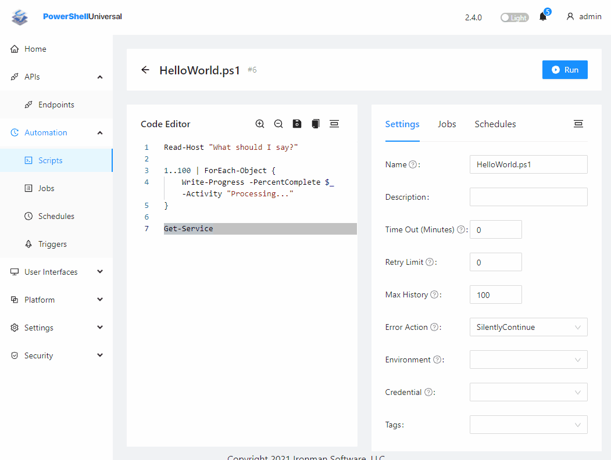

# ⏯️ Get Started

## Install PowerShell Universal

You'll need to install the PowerShell Universal server. [There are a lot of ways to do so](getting-started/) but you can use the command line below to get started quickly.



You can install PowerShell Universal as a service. Ensure that PowerShell is running as administrator or the service won't install correctly.

```powershell
Install-Module Universal
Install-PSUServer
```



You can install PowerShell Universal using the following shell script.

```
Install-Module Universal
Install-PSUServer
```



You can install PowerShell Universal using the Universal PowerShell module.

```
Install-Module Universal
Install-PSUServer -AddToPath
Start-PSUServer -Port 5000
```



```
wget https://imsreleases.blob.core.windows.net/universal/production/2.4.0/Universal.linux-arm.2.4.0.zip
unzip Universal.linux-arm.2.3.2.zip -d ./PSU
chmod +x ./PSU/Universal.Server
./PSU/Universal.Server

```



## Open PowerShell Universal

By default, PowerShell Universal is running on port 5000 of localhost. The first time you start the server, you will be prompted to set the local administrator user name and password. Next, login to the Admin Console.&#x20;

.png>)

## Create an API

APIs allow you to call PowerShell scripts over HTTP. To create an API, click API \ Endpoints and click Create New Endpoint. Specify a URL.

.png>)

Next, click details on the API that was created an enter the following command into the editor.

```
Get-ComputerInfo
```

Save the script and then click the Execute button to test it out.

.png>)

You can also execute the API via `Invoke-RestMethod`.

```
PS C:\Users\adamr> Invoke-RestMethod http://localhost:5000/hello-world

WindowsBuildLabEx                                       : 22000.1.amd64fre.co_release.210604-1628
WindowsCurrentVersion                                   : 6.3
WindowsEditionId                                        : Professional
WindowsInstallationType                                 : Client
WindowsInstallDateFromRegistry                          : 8/6/2021 4:05:12 PM
WindowsProductId                                        : 00330-52452-93139-AAOEM
WindowsProductName                                      : Windows 10 Pro
WindowsRegisteredOrganization                           :
```

## Create a Script

To create a script, click Automation \ Scripts and then click Create New Script.

.png>)

Enter the following script into the editor and save.

```powershell
Read-Host "What should I say?"

1..100 | ForEach-Object {
    Write-Progress -PercentComplete $_ -Activity "Processing..."
}

Get-Service
```

Once the script is saved, click Run.



## Create an App

To create a new PowerShell-based user interface (app), you can click User Interfaces \ Apps and then Create New App.

.png>)

After clicking Ok, click the Details button to edit the PowerShell script. Add the following script to the editor.

```powershell
New-UDApp -Title "Hello, World!" -Content {
    New-UDButton -Text "Click Me" -OnClick {
        Show-UDToast -Message 'Success!!'
    }
}
```

Save the app, click the Restart button and then click the View button. Click the Click Me button.

.png>)

Learn more about the various features of PowerShell Universal

* [APIs](api/about.md)
* [Automation](automation/about.md)
* [Apps](apps/building-dashboards.md)
