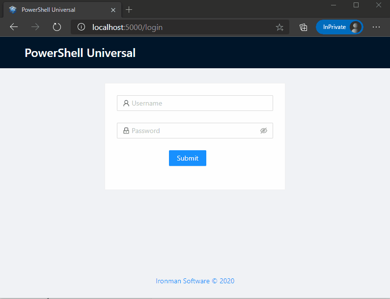

# Get Started

## Install PowerShell Universal

You'll need to install the PowerShell Universal server. [There are a lot of ways to do so](getting-started/) but you can use the command line below to get started quickly.



You can install PowerShell Universal as a service. Ensure that PowerShell is running as administrator or the service won't install correctly. 

```text
Invoke-WebRequest https://imsreleases.blob.core.windows.net/universal/production/2.0.0/PowerShellUniversal.2.0.0.msi -OutFile Universal.msi
msiexec /i Universal.msi /qn
```



You can install PowerShell Universal using the following shell script.

```text
 wget https://imsreleases.blob.core.windows.net/universal/production/2.0.0/Universal.linux-x64.2.0.0.zip
 sudo apt install unzip 
 unzip Universal.linux-x64.2.0.0.zip -d PSU
 chmod +x ./PSU/Universal.Server
 ./PSU/Universal.Server
```



You can install PowerShell Universal using the Universal PowerShell module.

```text
Install-Module Universal
Install-PSUServer -AddToPath
Start-PSUServer -Port 5000
```



```text
wget https://imsreleases.blob.core.windows.net/universal/production/2.0.0/Universal.linux-arm.2.0.0.zip
unzip Universal.linux-arm.2.0.0.zip -d ./PSU
chmod +x ./PSU/Universal.Server
./PSU/Universal.Server

```



## Open PowerShell Universal

By default, PowerShell Universal is running on port 5000 of localhost. You can access the admin console with the user name `admin` and any password.



## PowerShell Universal Visual Studio Code Extension

We recommend installing the [PowerShell Universal Visual Studio Code Extension](https://marketplace.visualstudio.com/items?itemName=ironmansoftware.powershell-universal) to provide the best possible editing experience.

You can connect to your instance of PowerShell Universal, browse and insert samples and get up and running right away.

### Install the Extension

Install the extension by searching for it in the extension page and clicking Install.


### Connect to PowerShell Universal

Click the PowerShell Universal icon on the left hand side and the extension will attempt to connect using the default URL and user name. The extension will notify you once it has connected.


### Inserting a Sample

[Samples ](https://github.com/ironmansoftware/universal-samples)are available via the sample browser. You can select a sample and insert it into your PowerShell Universal instance. You'll need to save the file that is opened by Visual Studio Code for the sample to be inserted.


Learn more about the various features of PowerShell Universal

* [APIs](../api/about.md)
* [Automation](../automation/about.md)
* [Dashboards](../dashboard/about.md)

