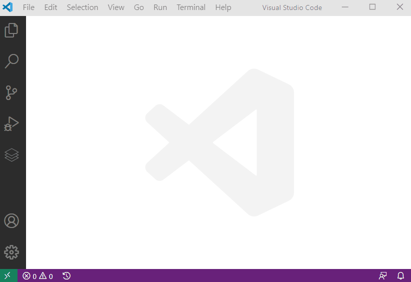

# Get Started

## Install PowerShell Universal



You can install PowerShell Universal as a service using Chocolatey.

```text
choco install powershelluniversal
```



You can install PowerShell Universal using the Universal PowerShell module.

```text
Install-Module Universal
Install-PSUServer -AddToPath
Start-PSUServer -Port 5000
```



You can install PowerShell Universal using the Universal PowerShell module.

```text
Install-Module Universal
Install-PSUServer -AddToPath
Start-PSUServer -Port 5000
```



## Open PowerShell Universal

By default, PowerShell Universal is running on port 5000 of localhost. You can access the admin console with the user name `admin` and any password.


## Install the PowerShell Universal Visual Studio Code Extension

We recommend installing the [PowerShell Universal Visual Studio Code Extension](https://marketplace.visualstudio.com/items?itemName=ironmansoftware.powershell-universal) to provide the best possible editing experience.

You can connect to your instance of PowerShell Universal, browse and insert samples and get up and running right away. 



Learn more about the various features of PowerShell Universal

* [APIs](../api/about.md)
* [Automation](../automation/about.md)
* [Dashboards](../dashboard/about.md)

