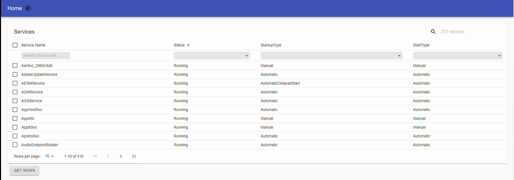

# Table

Tables display sets of data. They can be fully customized.

Tables display information in a way that’s easy to scan, so that users can look for patterns and insights. They can be embedded in primary content, such as cards.

## Simple Table

.png>)

A simple example with no frills. Table columns are defined from the data.

```powershell
$Data = @(
    @{Dessert = 'Frozen yoghurt'; Calories = 159; Fat = 6.0; Carbs = 24; Protein = 4.0}
    @{Dessert = 'Ice cream sandwich'; Calories = 159; Fat = 6.0; Carbs = 24; Protein = 4.0}
    @{Dessert = 'Eclair'; Calories = 159; Fat = 6.0; Carbs = 24; Protein = 4.0}
    @{Dessert = 'Cupcake'; Calories = 159; Fat = 6.0; Carbs = 24; Protein = 4.0}
    @{Dessert = 'Gingerbread'; Calories = 159; Fat = 6.0; Carbs = 24; Protein = 4.0}
)

New-UDTable -Data $Data
```

## Table with Custom Columns

.png>)

Define custom columns for your table.

```powershell
$Data = @(
    @{Dessert = 'Frozen yoghurt'; Calories = 159; Fat = 6.0; Carbs = 24; Protein = 4.0}
    @{Dessert = 'Ice cream sandwich'; Calories = 159; Fat = 6.0; Carbs = 24; Protein = 4.0}
    @{Dessert = 'Eclair'; Calories = 159; Fat = 6.0; Carbs = 24; Protein = 4.0}
    @{Dessert = 'Cupcake'; Calories = 159; Fat = 6.0; Carbs = 24; Protein = 4.0}
    @{Dessert = 'Gingerbread'; Calories = 159; Fat = 6.0; Carbs = 24; Protein = 4.0}
) 

$Columns = @(
    New-UDTableColumn -Property Dessert -Title "A Dessert"
    New-UDTableColumn -Property Calories -Title Calories 
    New-UDTableColumn -Property Fat -Title Fat 
    New-UDTableColumn -Property Carbs -Title Carbs 
    New-UDTableColumn -Property Protein -Title Protein 
)

New-UDTable -Id 'customColumnsTable' -Data $Data -Columns $Columns
```

## Table with Custom Column Rendering

.png>)

Define column rendering. Sorting and exporting still work for the table.

```powershell
$Data = @(
    @{Dessert = 'Frozen yoghurt'; Calories = 1; Fat = 6.0; Carbs = 24; Protein = 4.0}
    @{Dessert = 'Ice cream sandwich'; Calories = 159; Fat = 6.0; Carbs = 24; Protein = 4.0}
    @{Dessert = 'Eclair'; Calories = 159; Fat = 6.0; Carbs = 24; Protein = 4.0}
    @{Dessert = 'Cupcake'; Calories = 159; Fat = 6.0; Carbs = 24; Protein = 4.0}
    @{Dessert = 'Gingerbread'; Calories = 200; Fat = 6.0; Carbs = 24; Protein = 4.0}
) 

$Columns = @(
    New-UDTableColumn -Property Dessert -Title Dessert -Render { 
        New-UDButton -Id "btn$($EventData.Dessert)" -Text "Click for Dessert!" -OnClick { Show-UDToast -Message $EventData.Dessert } 
    }
    New-UDTableColumn -Property Calories -Title Calories 
    New-UDTableColumn -Property Fat -Title Fat 
    New-UDTableColumn -Property Carbs -Title Carbs 
    New-UDTableColumn -Property Protein -Title Protein 
)

New-UDTable -Data $Data -Columns $Columns -Sort -Export
```

## Table Column Width

Column width can be defined using the `-Width` parameter. You can also decide to truncate columns that extend past that width.

```powershell
$Data = @(
    @{Dessert = 'Frozen yoghurt'; Calories = 159; Fat = 6.0; Carbs = 24; Protein = 4.0}
    @{Dessert = 'Ice cream sandwich'; Calories = 159; Fat = 6.0; Carbs = 24; Protein = 4.0}
    @{Dessert = 'Eclair'; Calories = 159; Fat = 6.0; Carbs = 24; Protein = 4.0}
    @{Dessert = 'Cupcake'; Calories = 159; Fat = 6.0; Carbs = 24; Protein = 4.0}
    @{Dessert = 'Gingerbread'; Calories = 159; Fat = 6.0; Carbs = 24; Protein = 4.0}
) 

$Columns = @(
    New-UDTableColumn -Property Dessert -Title Dessert -Render { 
        New-UDButton -Id "btn$($EventData.Dessert)" -Text "Click for Dessert!" -OnClick { Show-UDToast -Message $EventData.Dessert } 
    }
    New-UDTableColumn -Property Calories -Title Calories -Width 5 -Truncate
    New-UDTableColumn -Property Fat -Title Fat 
    New-UDTableColumn -Property Carbs -Title Carbs 
    New-UDTableColumn -Property Protein -Title Protein 
)

New-UDTable -Data $Data -Columns $Columns -Sort
```

## Filters

You can configure custom filters per column. The table supports `text`, `select`, `fuzzy` , `slider`, `range`, `date` , `number`, and `autocomplete` filters.

```powershell
$Data = @(
    @{Dessert = 'Frozen yoghurt'; Calories = 159; Fat = 6.0; Carbs = 24; Protein = 4.0}
    @{Dessert = 'Ice cream sandwich'; Calories = 159; Fat = 6.0; Carbs = 24; Protein = 4.0}
    @{Dessert = 'Eclair'; Calories = 159; Fat = 6.0; Carbs = 24; Protein = 4.0}
    @{Dessert = 'Cupcake'; Calories = 159; Fat = 6.0; Carbs = 24; Protein = 4.0}
    @{Dessert = 'Gingerbread'; Calories = 159; Fat = 6.0; Carbs = 24; Protein = 4.0}
) 

$Columns = @(
    New-UDTableColumn -Property Dessert -Title "A Dessert" -Filter -FilterType AutoComplete
    New-UDTableColumn -Property Calories -Title Calories -Filter -FilterType Range
    New-UDTableColumn -Property Fat -Title Fat -Filter -FilterType Range
    New-UDTableColumn -Property Carbs -Title Carbs -Filter -FilterType Range
    New-UDTableColumn -Property Protein -Title Protein -Filter -FilterType Range
)

New-UDTable -Id 'customColumnsTable' -Data $Data -Columns $Columns -ShowFilter
```

.png>)

## Search

To enable search, use the `-ShowSearch` parameter on `New-UDTable`.

```powershell
$Data = @(
    @{Dessert = 'Frozen yoghurt'; Calories = 159; Fat = 6.0; Carbs = 24; Protein = 4.0}
    @{Dessert = 'Ice cream sandwich'; Calories = 159; Fat = 6.0; Carbs = 24; Protein = 4.0}
    @{Dessert = 'Eclair'; Calories = 159; Fat = 6.0; Carbs = 24; Protein = 4.0}
    @{Dessert = 'Cupcake'; Calories = 159; Fat = 6.0; Carbs = 24; Protein = 4.0}
    @{Dessert = 'Gingerbread'; Calories = 159; Fat = 6.0; Carbs = 24; Protein = 4.0}
)

New-UDTable -Data $Data -ShowSearch
```

When using custom columns, you will need to add the `-IncludeInSearch` parameter to the columns you'd like to include in the search.

```powershell
$Data = @(
    @{Dessert = 'Frozen yoghurt'; Calories = 159; Fat = 6.0; Carbs = 24; Protein = 4.0}
    @{Dessert = 'Ice cream sandwich'; Calories = 159; Fat = 6.0; Carbs = 24; Protein = 4.0}
    @{Dessert = 'Eclair'; Calories = 159; Fat = 6.0; Carbs = 24; Protein = 4.0}
    @{Dessert = 'Cupcake'; Calories = 159; Fat = 6.0; Carbs = 24; Protein = 4.0}
    @{Dessert = 'Gingerbread'; Calories = 159; Fat = 6.0; Carbs = 24; Protein = 4.0}
) 

$Columns = @(
    New-UDTableColumn -Property Dessert -Title "A Dessert" -IncludeInSearch
    New-UDTableColumn -Property Calories -Title Calories 
    New-UDTableColumn -Property Fat -Title Fat 
    New-UDTableColumn -Property Carbs -Title Carbs 
    New-UDTableColumn -Property Protein -Title Protein 
)

New-UDTable -Id 'customColumnsTable' -Data $Data -Columns $Columns -ShowSearch
```

## Table with server-side processing

Process data on the server so you can perform paging, filtering, sorting and searching in systems like SQL. To implement a server-side table, you will use the `-LoadData` parameter. This parameter accepts a `ScriptBlock`. The `$EventData` variable includes information about the state of the table. You can use cmdlets to process the data based on this information.

### $EventData Structure

The `$EventData` object contains the following properties.

| Property Name  | Type                                                                                         | Description                                                                 |
| -------------- | -------------------------------------------------------------------------------------------- | --------------------------------------------------------------------------- |
| Filters        | <p>Hashtable[]<br><br>@{ <br>    id = 'fieldName'</p><p>    value = 'filterValue'<br> } </p> | A list of filter values. Each hashtable has an `Id` and a `Value` property. |
| OrderBy        | <p>Hashtable<br><br>@{ field = "fieldName" }</p>                                             | Property name to sort by.                                                   |
| OrderDirection | string                                                                                       | `asc` or `desc` depending on the sort order.                                |
| Page           | int                                                                                          | The current page (starting with 0).                                         |
| PageSize       | int                                                                                          | The selected page size.                                                     |
| Properties     | string\[]                                                                                    | An array of properties being shown in the table.                            |
| Search         | string                                                                                       | A search string provided by the user.                                       |
| TotalCount     | int                                                                                          | The total number of records before filtering or paging.                     |

### Example

```powershell
$Columns = @(
    New-UDTableColumn -Property Name -Title "Name" -ShowFilter
    New-UDTableColumn -Property Value -Title "Value" -ShowFilter
)

$Data = 1..1000 | ForEach-Object {
  [PSCustomObject]@{
      Name = "Record-$_"
      Value = $_ 
  }
}

New-UDTable -Columns $Columns -LoadData {
    foreach($Filter in $EventData.Filters)
    {
        $Data = $Data | Where-Object -Property $Filter.Id -Match -Value $Filter.Value
    }

    $TotalCount = $Data.Count 

    if (-not [string]::IsNullOrEmpty($EventData.OrderBy.Field))
    {
        $Descending = $EventData.OrderDirection -ne 'asc'
        $Data = $Data | Sort-Object -Property ($EventData.orderBy.Field) -Descending:$Descending
    }
    
    $Data = $Data | Select-Object -First $EventData.PageSize -Skip ($EventData.Page * $EventData.PageSize)

    $Data | Out-UDTableData -Page $EventData.Page -TotalCount $TotalCount -Properties $EventData.Properties 
} -ShowFilter -ShowSort -ShowPagination
```

### Retrieving Displayed Data

You may want to allow the user to take action on the current set of displayed data. To do so, use `Get-UDElement` in the input object you want to retrieve the data from and get the table by Id. Once you have the element, you can use the `CurrentData` property of the element to get an array of currently displayed rows.

```powershell
$Columns = @(
    New-UDTableColumn -Property Name -Title "Name" -ShowFilter
    New-UDTableColumn -Property Value -Title "Value" -ShowFilter
)

$Data = 1..1000 | ForEach-Object {
  @{
      Name = "Record-$_"
      Value = $_ 
  }
}

New-UDButton -Text 'Get Filtered Data' -OnClick {
    $Element = Get-UDElement -Id 'filteredTable'
    Show-UDModal -Content {
        New-UDElement -Tag 'pre' -Content {
           $Element | ConvertTo-Json
        }
    }
}

New-UDTable -Id 'filteredTable' -Columns $Columns -LoadData {
    foreach($Filter in $EventData.Filters)
    {
        $Data = $Data | Where-Object -Property $Filter.Id -Match -Value $Filter.Value
    }

    $TotalCount = $Data.Count 

    if (-not [string]::IsNullOrEmpty($EventData.OrderBy))
    {
        $Descending = $EventData.OrderDirection -ne 'asc'
        $Data = $Data | Sort-Object -Property $EventData.orderBy -Descending:$Descending
    }
    
    $Data = $Data | Select-Object -First $EventData.PageSize -Skip ($EventData.Page * $EventData.PageSize)

    $Data | Out-UDTableData -Page $EventData.Page -TotalCount $TotalCount -Properties $EventData.Properties 
} -ShowFilter -ShowSort -ShowPagination
```

## Paging

By default, paging is disable and tables will grow based on how many rows of data you provide. You can enable paging by using the `-ShowPagination` cmdlet (alias `-Paging`). You can configure the page size using the `-PageSize` cmdlet.

```powershell
$Data = @(
    @{Dessert = 'Frozen yoghurt'; Calories = 159; Fat = 6.0; Carbs = 24; Protein = 4.0}
    @{Dessert = 'Ice cream sandwich'; Calories = 159; Fat = 6.0; Carbs = 24; Protein = 4.0}
    @{Dessert = 'Eclair'; Calories = 159; Fat = 6.0; Carbs = 24; Protein = 4.0}
    @{Dessert = 'Cupcake'; Calories = 159; Fat = 6.0; Carbs = 24; Protein = 4.0}
    @{Dessert = 'Gingerbread'; Calories = 159; Fat = 6.0; Carbs = 24; Protein = 4.0}
) 

New-UDTable -Data $Data -Paging -PageSize 2
```

### Disable Page Size All

By default, the page size selector provides an option to show all rows. If you want to prevent users from doing this, use the `-DisablePageSizeAll` cmdlet.

### Pagination Location

You can change the location of the pagination control by using the `-PaginationLocation` parameter. It accepts top, bottom and both.

.png>)

## Sorting

To enable sorting for a table, use the `-ShowSort` parameter. When you enable sorting, you will be able to click the table headers to sort the table by clicking the headers. By default, multi-sort is enabled. To multi-hold shift and click a column header.

```powershell
$Data = @(
    @{Dessert = 'Frozen yoghurt'; Calories = 159; Fat = 6.0; Carbs = 24; Protein = 4.0}
    @{Dessert = 'Ice cream sandwich'; Calories = 159; Fat = 6.0; Carbs = 24; Protein = 4.0}
    @{Dessert = 'Eclair'; Calories = 159; Fat = 6.0; Carbs = 24; Protein = 4.0}
    @{Dessert = 'Cupcake'; Calories = 159; Fat = 6.0; Carbs = 24; Protein = 4.0}
    @{Dessert = 'Gingerbread'; Calories = 159; Fat = 6.0; Carbs = 24; Protein = 4.0}
) 

New-UDTable -Data $Data -ShowSort
```

You can control which columns can be sorted by using `New-UDTableColumn` and `-ShowSort` parameter.

```powershell
    @{Dessert = 'Eclair'; Calories = 159; Fat = 6.0; Carbs = 24; Protein = 4.0}
    @{Dessert = 'Cupcake'; Calories = 159; Fat = 6.0; Carbs = 24; Protein = 4.0}
    @{Dessert = 'Gingerbread'; Calories = 159; Fat = 6.0; Carbs = 24; Protein = 4.0}
) 

$Columns = @(
    New-UDTableColumn -Property Dessert -Title "A Dessert" -ShowSort
    New-UDTableColumn -Property Calories -Title Calories 
    New-UDTableColumn -Property Fat -Title Fat 
    New-UDTableColumn -Property Carbs -Title Carbs -ShowSort
    New-UDTableColumn -Property Protein -Title Protein -ShowSort
)

New-UDTable -Id 'customColumnsTable' -Data $Data -Columns $Columns
```

### Disable Sort Remove

By default, the sorting of a table has 3 states. Unsorted, ascending and descending. If you would like to disable the unsorted state, use the `-DisableSortRemove` parameter of `New-UDTable`.

```powershell
$Data = @(
    @{Dessert = 'Frozen yoghurt'; Calories = 159; Fat = 6.0; Carbs = 24; Protein = 4.0}
    @{Dessert = 'Ice cream sandwich'; Calories = 159; Fat = 6.0; Carbs = 24; Protein = 4.0}
    @{Dessert = 'Eclair'; Calories = 159; Fat = 6.0; Carbs = 24; Protein = 4.0}
    @{Dessert = 'Cupcake'; Calories = 159; Fat = 6.0; Carbs = 24; Protein = 4.0}
    @{Dessert = 'Gingerbread'; Calories = 159; Fat = 6.0; Carbs = 24; Protein = 4.0}
) 

New-UDTable -Data $Data -ShowSort -DisableSortRemove
```

## Selection

Tables support selection of rows. You can create an event handler for the `OnRowSelected` parameter to receive when a new row is selected or unselected or you can use `Get-UDElement` to retrieve the current set of selected rows.

The following example creates a table with row selection enabled. A toast is show when clicking the row or when clicking the GET Rows button.

```powershell
$Data = try { get-service -ea Stop | select Name,@{n = "Status";e={ $_.Status.ToString()}},@{n = "StartupType";e={ $_.StartupType.ToString()}},@{n = "StartType";e={ $_.StartType.ToString()}} } catch {}
$Columns = @(
    New-UDTableColumn -Property Name -Title "Service Name" -ShowSort -IncludeInExport -IncludeInSearch -ShowFilter -FilterType text
    New-UDTableColumn -Property Status -Title Status -ShowSort -DefaultSortColumn -IncludeInExport -IncludeInSearch -ShowFilter -FilterType select 
    New-UDTableColumn -Property StartupType -Title StartupType -IncludeInExport -ShowFilter -FilterType select
    New-UDTableColumn -Property StartType -Title StartType -IncludeInExport -ShowFilter -FilterType select 
)
New-UDTable -Id 'service_table' -Data $Data -Columns $Columns -Title 'Services' -ShowSearch -ShowPagination -ShowSelection -Dense -OnRowSelection {
    $Item = $EventData
    Show-UDToast -Message "$($Item | out-string)"
}
New-UDButton -Text "GET Rows" -OnClick {
    $value = Get-UDElement -Id "service_table"
    Show-UDToast -Message "$( $value.selectedRows | Out-String )"
}
```



The `$EventData` variable for the `-OnRowSelected` event will include all the columns as properties and a selected property as to whether the row was selected or unselected.

For example, the service table data would look like this.

```powershell
@{
   Id = 0
   Name = 'AESMService',
   Status = 'Running'
   StartupType = 'AutomaticDelayedStart'
   StartType = 'Automation'
   selected = $true
}
```

## Collapsible Rows

You can include additional information within the table by using the `-OnRowExpand` parameter of `New-UDTable`. It accepts a ScriptBlock that you can use to return additional components.&#x20;

```powershell
New-UDTable -Data (Get-Service) -OnRowExpand {
    New-UDAlert -Text $EventData.DisplayName
} -Columns @(
    New-UDTableColumn -Title 'Name' -Property 'Name'
    New-UDTableColumn -Title 'Status' -Property 'Status'
)
```

.png>)

## Exporting

Tables support exporting the data within the table. You can export as CSV, XLSX, JSON or PDF. You can define which columns to include in an export and choose to export just the current page or all the data within the table.

```powershell
$Data = try { get-service -ea Stop | select Name,@{n = "Status";e={ $_.Status.ToString()}},@{n = "StartupType";e={ $_.StartupType.ToString()}},@{n = "StartType";e={ $_.StartType.ToString()}} } catch {}
$Columns = @(
    New-UDTableColumn -Property Name -Title "Service Name" -IncludeInExport
    New-UDTableColumn -Property Status -Title Status 
    New-UDTableColumn -Property StartupType
    New-UDTableColumn -Property StartType -IncludeInExport
)
New-UDTable -Id 'service_table' -Data $Data -Columns $Columns -Title 'Services' -ShowSearch -ShowPagination -Dense -Export
```

.png>)

### Hidden Columns

Hidden columns allow you to include data that is not displayed in the table but is included in the exported data.

The following hides the StartType column from the user but includes it in the export.

```powershell
$Data = try { get-service -ea Stop | select Name,@{n = "Status";e={ $_.Status.ToString()}},@{n = "StartupType";e={ $_.StartupType.ToString()}},@{n = "StartType";e={ $_.StartType.ToString()}} } catch {}
$Columns = @(
    New-UDTableColumn -Property Name -Title "Service Name" -IncludeInExport
    New-UDTableColumn -Property Status -Title Status 
    New-UDTableColumn -Property StartupType
    New-UDTableColumn -Property StartType -IncludeInExport -Hidden
)
New-UDTable -Id 'service_table' -Data $Data -Columns $Columns -Title 'Services' -ShowSearch -ShowPagination -Dense -Export
```

## Server-Side Exporting

You can control the export functionality with a PowerShell script block. This is useful when exporting from server-side sources like SQL server tables.

In this example, I have a SQL table that contains podcasts. When exporting, you will receive information about the current state of the table to allow you to customize what data is exported.

```powershell
New-UDDashboard -Title "Hello, World!" -Content {
    New-UDTable -Title 'Shows' -LoadData {
        $TableData = ConvertFrom-Json $Body

        $OrderBy = $TableData.orderBy.field
        if ($OrderBy -eq $null)
        {
            $OrderBy = "name"
        }

        $OrderDirection = $TableData.OrderDirection
        if ($OrderDirection -eq $null)
        {
            $OrderDirection = 'asc'
        }

        $Where = ""
        if ($TableData.Filters) 
        {
            $Where = "WHERE "

            foreach($filter in $TableData.Filters)
            {
                $Where += $filter.column.field + " LIKE '%" + $filter.value + "%' AND "
            }

            $Where += " 1 = 1"
        }

        $PageSize = $TableData.PageSize 
        # Calculate the number of rows to skip
        $Offset = $TableData.Page * $PageSize
        $Count = Invoke-DbaQuery -SqlInstance localhost\MSSQLSERVER -Database 'podcasts' -Query "SELECT COUNT(*) as count FROM shows $Where"

        $Data = Invoke-DbaQuery -SqlInstance localhost\MSSQLSERVER -Database 'podcasts' -Query "SELECT * FROM shows $Where ORDER BY $orderBy $orderdirection OFFSET $Offset ROWS FETCH NEXT $PageSize ROWS ONLY" | ForEach-Object {
            @{ 
                name = $_.name 
                host = $_.host
            }
        } 
        $Data | Out-UDTableData -Page $TableData.page -TotalCount $Count.Count -Properties $TableData.properties
    } -Columns @(
        New-UDTableColumn -Property 'name' -Sort -Filter -Export
        New-UDTableColumn -Property 'host' -Sort -Filter -Export
    ) -Sort -Filter -Export -OnExport {
        $Query = $Body | ConvertFrom-Json

        <# Query will contain
            filters: []
            orderBy: undefined
            orderDirection: ""
            page: 0
            pageSize: 5
            properties: (5) ["dessert", "calories", "fat", "carbs", "protein"]
            search: ""
            totalCount: 0
            allRows: true
        #>

        Invoke-DbaQuery -SqlInstance localhost\MSSQLSERVER -Database 'podcasts' -Query "SELECT * FROM shows" | ForEach-Object {
            @{ 
                name = $_.name 
                host = $_.host
            }
        } 
    }
}
```

## Customizing Export Options

You can decide which export options to present to your users using the `-ExportOption` cmdlet. The following example would only show the CSV export option.

```powershell
$Data = try { get-service -ea Stop | select Name,@{n = "Status";e={ $_.Status.ToString()}},@{n = "StartupType";e={ $_.StartupType.ToString()}},@{n = "StartType";e={ $_.StartType.ToString()}} } catch {}
$Columns = @(
    New-UDTableColumn -Property Name -Title "Service Name" -IncludeInExport
    New-UDTableColumn -Property Status -Title Status 
    New-UDTableColumn -Property StartupType
    New-UDTableColumn -Property StartType -IncludeInExport
)
New-UDTable -Id 'service_table' -Data $Data -Columns $Columns -Title 'Services' -ShowSearch -ShowPagination -Dense -Export -ExportOption "csv"
```

## Customizing Labels

You can use the `-TextOption` parameter along with the `New-UDTableTextOption` cmdlet to set text fields within the table.

```powershell
$Data = @(
    @{Dessert = 'Frozen yoghurt'; Calories = 159; Fat = 6.0; Carbs = 24; Protein = 4.0}
    @{Dessert = 'Ice cream sandwich'; Calories = 159; Fat = 6.0; Carbs = 24; Protein = 4.0}
    @{Dessert = 'Eclair'; Calories = 159; Fat = 6.0; Carbs = 24; Protein = 4.0}
    @{Dessert = 'Cupcake'; Calories = 159; Fat = 6.0; Carbs = 24; Protein = 4.0}
    @{Dessert = 'Gingerbread'; Calories = 159; Fat = 6.0; Carbs = 24; Protein = 4.0}
) 

$Option = New-UDTableTextOption -Search "Search all these records"

New-UDTable -Data $Data -TextOption $Option -ShowSearch
```

## Refresh with a button

### Data Parameter

You can externally refresh a table by putting the table within a dynamic region and using `Sync-UDElement`.

This example creates a button to refresh the table.

```powershell
New-UDDynamic -Id 'table' -Content {
    $Data = Get-Service
    New-UDTable -Data $Data -Paging
} -LoadingComponent {
    "Loading"
}

New-UDButton -Text 'Refresh Table' -OnClick {
    Sync-UDElement -Id 'table'
}
```

### LoadData Parameter

If you use the `-LoadData` parameter, you can sync the table directly. This has the benefit of maintaining the table state, such as the page and filtering, after the refresh.&#x20;

```powershell
New-UDButton -Text 'Table1' -OnClick { Sync-UDElement -Id 'Table1' }

$Columns = @(
    New-UDTableColumn -Property Name -Title "Name" -ShowFilter -Render { $EventData.Name }
    New-UDTableColumn -Property Value -Title "Value" -ShowFilter
)

New-UDTable -Columns $Columns -LoadData {
    $Data = 1..1000 | ForEach-Object {
        @{
            Name = "Record-$_"
            Value = $_ 
        }
    }
    
    foreach($Filter in $EventData.Filters)
    {
        $Data = $Data | Where-Object -Property $Filter.Id -Match -Value $Filter.Value
    }

    $TotalCount = $Data.Count 

    if (-not [string]::IsNullOrEmpty($EventData.OrderBy))
    {
        $Descending = $EventData.OrderDirection -ne 'asc'
        $Data = $Data | Sort-Object -Property $EventData.orderBy -Descending:$Descending
    }
    
    $Data = $Data | Select-Object -First $EventData.PageSize -Skip ($EventData.Page * $EventData.PageSize)

    $Data | Out-UDTableData -Page $EventData.Page -TotalCount $TotalCount -Properties $EventData.Properties 
} -ShowFilter -ShowSort -ShowPagination  -Id 'Table1'
```

## Show Refresh Button

You can use the `-ShowRefresh` parameter to provide a refresh button for server-side tables.

```powershell
$Columns = @(
    New-UDTableColumn -Property Dessert -Title "A Dessert"
    New-UDTableColumn -Property Calories -Title Calories 
    New-UDTableColumn -Property Fat -Title Fat 
    New-UDTableColumn -Property Carbs -Title Carbs 
    New-UDTableColumn -Property Protein -Title Protein 
)

New-UDTable -ShowRefresh -Columns $Columns -LoadData {
    $Query = $Body | ConvertFrom-Json

    <# Query will contain
        filters: []
        orderBy: undefined
        orderDirection: ""
        page: 0
        pageSize: 5
        properties: (5) ["dessert", "calories", "fat", "carbs", "protein"]
        search: ""
        totalCount: 0
    #>

    @(
        @{Dessert = 'Frozen yoghurt'; Calories = (Get-Random); Fat = 6.0; Carbs = 24; Protein = 4.0}
        @{Dessert = 'Ice cream sandwich'; Calories = (Get-Random); Fat = 6.0; Carbs = 24; Protein = 4.0}
        @{Dessert = 'Eclair'; Calories = (Get-Random); Fat = 6.0; Carbs = 24; Protein = 4.0}
        @{Dessert = 'Cupcake'; Calories = (Get-Random); Fat = 6.0; Carbs = 24; Protein = 4.0}
        @{Dessert = 'Gingerbread'; Calories = (Get-Random); Fat = 6.0; Carbs = 24; Protein = 4.0}
    ) | Out-UDTableData -Page 0 -TotalCount 5 -Properties $Query.Properties 
}
```

## Alternating Row Colors

You can use a theme to create a table with alternating row colors.&#x20;

<figure><figcaption></figcaption></figure>

```powershell
$Theme = @{
    overrides = @{
        MuiTableRow = @{
            root = @{
                '&:nth-of-type(odd)' = @{
                    backgroundColor = "rgba(0,0,0,0.04)"
                }
            }
            head = @{
                backgroundColor = "rgb(255,255,255) !important"
            }
        }
    }
}

New-UDDashboard -Content {
$data = 1..10 | % { [PSCustomObject]@{ Item = $_}}
  New-UDTable -ShowPagination -PageSize 10 -PageSizeOptions @(10, 10) -DisablePageSizeAll -Columns @(
        New-UDTableColumn -Property 'Item' -Title 'Item' -Width 180 -Truncate
    ) -Data $Data -Dense -ShowSearch
} -Theme $Theme
```

## API

* [New-UDTable](https://github.com/ironmansoftware/universal-docs/blob/master/cmdlets/New-UDTable.txt)
* [New-UDTableColumn](https://github.com/ironmansoftware/universal-docs/blob/master/cmdlets/New-UDTableColumn.txt)
* [Out-UDTableColumn](https://github.com/ironmansoftware/universal-docs/blob/master/cmdlets/Out-UDTableData.txt)
* [New-UDTableTextOption](https://github.com/ironmansoftware/universal-docs/blob/master/cmdlets/New-UDTableTextOption.txt)
