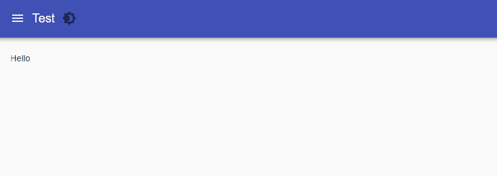

# Pages

A dashboard can consist of one or more pages. A page can have a particular name and URL. You can define a URL that accepts one or more variables in the URL to define a dynamic page.

## Basic Page

A basic page can be defined using the `New-UDPage` cmdlet. You could navigate to this page by visiting the `/dashboard` URL of your dashboard.

```powershell
$Pages = @()
$Pages += New-UDPage -Name 'Dashboard' -Content {
    New-UDTypography -Text 'Dashboard'
}

New-UDDashboard -Title 'Pages' -Pages $Pages
```

## Dashboard with Multiple Pages

Dashboards can have multiple pages and those pages can be defined by passing an array of UDPages to `New-UDDashboard`

```powershell
$Pages = @()
$Pages += New-UDPage -Name 'Dashboard One' -Content {
    New-UDTypography -Text 'Dashboard Two'
}

$Pages += New-UDPage -Name 'Dashboard Two' -Content {
    New-UDTypography -Text 'Dashboard Two'
}

New-UDDashboard -Title 'Pages' -Pages $Pages
```

You may want to organize your dashboard into multiple PS1 files. You can do this using pages.

```powershell
$UDScriptRoot = $PSScriptRoot
$Pages = @()
$Pages += New-UDPage -Name 'Dashboard One' -Content {
    . "$UDScriptRoot\db1.ps1"
}

$Pages += New-UDPage -Name 'Dashboard Two' -Content {
    . "$UDScriptRoot\db2.ps1"
}

New-UDDashboard -Title 'Pages' -Pages $Pages
```

## Page with a Custom URL

A page can have a custom URL by using the `-Url` parameter. You could navigate to this page by visiting the `/db` URL of your dashboard.

```powershell
$Pages = @()
$Pages += New-UDPage -Name 'Dashboard' -Url '/db' -Content {
    New-UDTypography -Text 'Dashboard'
}

New-UDDashboard -Title 'Pages' -Pages $Pages
```

## Page with Variables in URL

You can define a page with variables in the URL to create pages that adapt based on that URL.

```powershell
$Pages = @()
$Pages += New-UDPage -Name 'Dashboard' -Url '/db/:user' -Content {
    New-UDTypography -Text 'Dashboard for user: $User'
}

New-UDDashboard -Title 'Pages' -Pages $Pages
```

### Query string parameters

Query string parameters are passed to pages and other endpoints as variables.

For example, if you visited a page with the following query string parameter: `http://localhost:5000/dashboard/Page1?test=123`

You would then have access to a `$Test` variable that contained the value `123`.

## Role-Based Access


This feature requires a [license](../../../licensing.md).


You can prevent users from accessing pages based on their role by using the `-Role` parameter of pages. You can configure roles and role policies on the [Security page](../../../config/security/#policy-assignment).

```powershell
$Pages = @()
$Pages += New-UDPage -Name 'Administrators' -Content {
    New-UDTypography -Text 'Dashboard for user: $User'
} -Role 'Administrator'

$Pages += New-UDPage -Name 'Operators' -Content {
    New-UDTypography -Text 'Dashboard for user: $User'
} -Role 'Operator'

New-UDDashboard -Title 'Pages' -Pages $Pages
```

## Header

The following options are available for customizing the header.&#x20;

### Position


Available in PowerShell Universal 2.5 or later.


Use the `-HeaderPosition` parameter to adjust the behavior of the header.&#x20;

* absolute\fixed - Remains at the top of the page, even when scrolling
* relative - Remains at the top of the page. Not visible when scrolling.

```powershell
New-UDPage -HeaderPosition fixed -Content {
    New-UDElement -tag div -Attributes @{
        style = @{
            height = '150vh'
        }
    }
}
```

### Colors


Available in PowerShell Universal 2.5 or later.


You can adjust the colors of the header by specifying the `-HeaderColor` and `-HeaderBackgroundColor` parameters. These colors will override the theme colors.&#x20;

```powershell
New-UDPage -Name 'Home' -Content {
} -HeaderColor 'black' -HeaderBackgroundColor 'white'
```

## Navigation

You can customize the navigation of a page using the `-Navigation` and `-NavigationLayout` parameters. Navigation is defined using the [List](data-display/list.md#list) component. Navigation layouts are either permanent or temporary.

### Custom Navigation

Custom navigation can be defined with a list. List items can include children to create drop down sections in the navigation.

```powershell
$Navigation = @(
    New-UDListItem -Label "Home"
    New-UDListItem -Label "Getting Started" -Children {
        New-UDListItem -Label "Installation" -OnClick { Invoke-UDRedirect '/installation' }
        New-UDListItem -Label "Usage" -OnClick { Invoke-UDRedirect '/usage' }
        New-UDListItem -Label "FAQs" -OnClick { Invoke-UDRedirect '/faqs' }
        New-UDListItem -Label "System Requirements" -OnClick { Invoke-UDRedirect '/requirements' }
        New-UDListItem -Label "Purchasing" -OnClick { Invoke-UDRedirect '/purchasing'}
    }
)

$Pages = @()
$Pages += New-UDPage -Name 'Test' -Content {
 New-UDTypography -Text "Hello"
} -NavigationLayout permanent -Navigation $Navigation

$Pages += New-UDPage -Name 'Test2' -Content {
    New-UDTypography -Text "Hello"
} -NavigationLayout permanent -Navigation $Navigation


New-UDDashboard -Title "Hello, World!" -Pages $Pages
```

.png>)

### Dynamic Navigation

Dynamic navigation can be used to execute scripts during page load to determine which navigation components to show based on variables like the user, IP address or roles.

You can generate dynamic navigation by using the `-LoadNavigation` parameter. The value of the parameter should be a script block to execute when loading the navigation.

```powershell
$Navigation = {
    New-UDListItem -Label "Home - $(Get-Date)"
    New-UDListItem -Label "Getting Started" -Children {
        New-UDListItem -Label "Installation" -OnClick { Invoke-UDRedirect '/installation' }
        New-UDListItem -Label "Usage" -OnClick { Invoke-UDRedirect '/usage' }
        New-UDListItem -Label "FAQs" -OnClick { Invoke-UDRedirect '/faqs' }
        New-UDListItem -Label "System Requirements" -OnClick { Invoke-UDRedirect '/requirements' }
        New-UDListItem -Label "Purchasing" -OnClick { Invoke-UDRedirect '/purchasing'}
    }
}

$Pages = @()
$Pages += New-UDPage -Name 'Test' -Content {
 New-UDTypography -Text "Hello"
} -NavigationLayout permanent -LoadNavigation $Navigation

$Pages += New-UDPage -Name 'Test2' -Content {
    New-UDTypography -Text "Hello"
} -NavigationLayout permanent -LoadNavigation $Navigation


New-UDDashboard -Title "Hello, World!" -Pages $Pages
```

### Layouts

The permanent layout creates a static navigation drawer on the left hand side of the page. It cannot be hidden by the user.

```powershell
$Pages = @()
$Pages += New-UDPage -Name 'Test' -Content {
 New-UDTypography -Text "Hello"
} -NavigationLayout permanent

$Pages += New-UDPage -Name 'Test2' -Content {
    New-UDTypography -Text "Hello"
} -NavigationLayout permanent


New-UDDashboard -Title "Hello, World!" -Pages $Pages
```

.png>)

The temporary layout creates a navigation drawer that can be opened using a hamburger menu found in the top left corner. This is the default setting.

```powershell
$Pages = @()
$Pages += New-UDPage -Name 'Test' -Content {
 New-UDTypography -Text "Hello"
} -NavigationLayout temporary

$Pages += New-UDPage -Name 'Test2' -Content {
    New-UDTypography -Text "Hello"
} -NavigationLayout temporary


New-UDDashboard -Title "Hello, World!" -Pages $Pages
```



## Logo

You can display a logo in the navigation bar by using the `-Logo` parameter.

First, setup a [published folder](../../../platform/published-folders.md) to host your logo.

.png>)

Now, when creating your page, you can specify the path to the logo.

```powershell
New-UDPage -Name 'Home' -Logo '/assets/favicon.png' -Content {
}
```

The logo will display in the top left corner.

.png>)

To customize the style of your logo, you can use a [cascading style sheet](../themes/cascading-style-sheets.md) and target the `ud-logo` element ID.

## Header Content


Requires PowerShell Universal 2.8 or later.


You can define custom content to include in the header by using the `-HeaderContent` parameter.&#x20;

```powershell
$Page = New-UDPage -Name 'Home' -Content {

} -HeaderContent {
    New-UDButton -Icon (New-UDIcon -Icon Users) -Text 'User'
}

New-UDDashboard -Title "Dashboard" -Pages $Page
```

.png>)

## API

[New-UDPage](https://github.com/ironmansoftware/universal-docs/blob/master/cmdlets/New-UDPage.txt)

