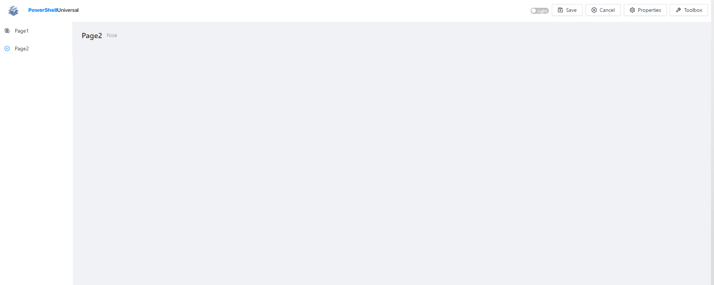
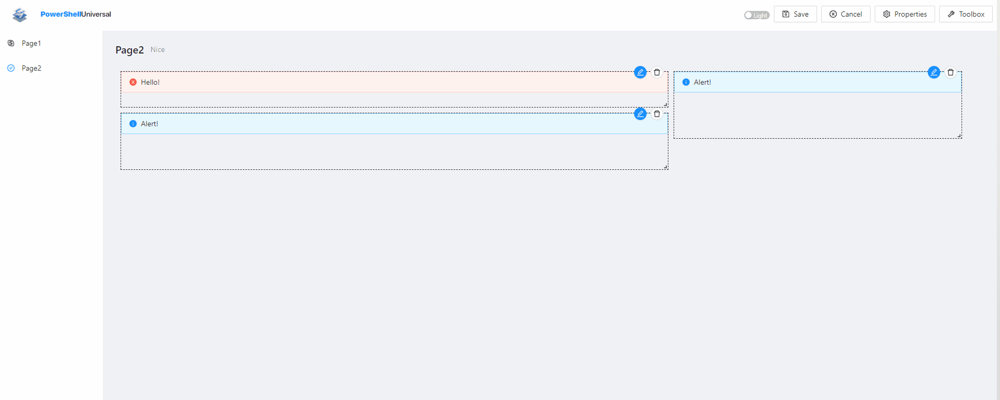

# Pages

Pages allow you to create basic websites that do not require any coding of the user interface. You can drag and drop UI components on to the designer and set properties of each component. Components can interact with APIs and Scripts that are defined within Universal.&#x20;

## Adding a Page

To add a page, navigate to User Interfaces \ Pages within the admin console. Click the Create New Page button to create a page.&#x20;

The name of the page will also be the URL used to access the page.&#x20;

.png>)

Pages can take advantage of role based access. You can turn on authentication for a page and limit the access to the page to users based on role. This feature requires a license.&#x20;

## Editing a Page

To edit the content of the page, you can view the page as an administrator. When you view the page, you will have access to an edit button for managing the components and layout of the page.&#x20;


## Adding a Component

To add a component, click the Toolbox button and select the component to add. Properties for a component can be set by clicking the properties button on the component and editing the required and optional properties.&#x20;



## Layouts

Layouts are setup by resizing and dragging components around the designer surface. Layouts are responsive. If you want to setup layouts for smaller screens, reduce the width of your window and setup a new layout.&#x20;



## Invoking Scripts and APIs

Certain components can interact with scripts or API endpoints. These include buttons, forms, statistics and tables. You can configure the script or API that is invoked as well as the parameters that are passed to those targets.&#x20;

This example uses a script to populate a table.&#x20;

.gif>)

This example invokes a script when a button is clicked.&#x20;


## Grouping Pages


Available in PowerShell Universal 2.5 or later.


Grouping pages will create nested navigation within the page section. Select a group in the page properties. Matching pages will be displayed in that group.

&#x20;

.png>)

## Page URLs

By default, the page URL will be the Name of the page. So for example, if the page's name was Services the URL will be `/Services`.&#x20;

You can customize the URL in the page properties.&#x20;

### Default URL


Available in PowerShell Universal 2.5 or later.


You can change the default URL of the PowerShell Universal instance by setting the page URL to `/` . When users login or visit the server name directly, they will not be directed to `/admin` but rather the page defined with `/`.&#x20;

## Configuration Files

Pages are stored as XML. Unlike dashboards, they do not allow for direct programmatic configuration. The layout and components are static but can interact with APIs and scripts.&#x20;

```
<?xml version="1.0" encoding="utf-8"?>
<Page xmlns:xsi="http://www.w3.org/2001/XMLSchema-instance" xmlns:xsd="http://www.w3.org/2001/XMLSchema" Name="Page1" Description="This is a great page. " Authenticated="false" Icon="SkypeOutlined" ShowInNavigation="false">
  <Components>
    <Button Id="c2ca3c4a-d729-40cd-818e-528c2991ff10" Text="Button" Icon="ContactsFilled" ToastOnSuccess="true" ToastOnFailure="true" RefreshComponents="false">
      <Target Name="Simple.ps1" Type="script">
        <Parameters />
      </Target>
    </Button>
    <Form Id="a7bf92a3-4d44-4db0-88ab-d24c5992b9b1" Title="Form" Description="asdfadsf" RefreshComponents="false">
      <Target Name="Simple.ps1" Type="script">
        <Fields>
          <Field Name="Nice" Type="textbox" Required="false" />
        </Fields>
      </Target>
    </Form>
    <Table Id="9dc0c2b4-7d51-48bd-9676-72a480e44126" Title="Table" DataSourceType="api" DataSource="/test">
      <Columns />
    </Table>
    <Statistic Id="932c6746-d810-49a3-b3f1-676672c82267" Title="Statistic" DataSourceType="api" DataSource="/random" Precision="0" AutoReload="true" AutoReloadSeconds="4" />
    <Text Id="4acc622e-7bfa-475a-b9e8-5382735c8f54" Value="What the heck!!!?????" Code="false" Copyable="false" Ellipsis="false" Keyboard="false" Marked="false" Bold="false" Italic="false" type="warning" Underline="false" />
    <Statistic Id="071e2a46-55ee-49f4-bfab-6a3ec26e5089" Title="Statistic" DataSourceType="api" DataSource="/random" Prefix="asdfasdfa" Suffix="asdfsafas" Precision="0" AutoReload="true" AutoReloadSeconds="15" />
    <Title Id="2411846c-6d95-4a58-af4b-fe65e882acff" Value="Title" Code="true" Copyable="false" Ellipsis="false" Keyboard="false" Marked="false" Bold="false" Italic="false" Underline="false" Level="2" />
    <Paragraph Id="c99786a9-4e49-4ef0-a4b7-33ec5a5ea9b4" Value="Paragraph" Code="true" Copyable="false" Ellipsis="false" Keyboard="false" Marked="false" Bold="false" Italic="false" type="success" Underline="false" />
  </Components>
  <Layout>
    <Lg>
      <LayoutItem Id="c2ca3c4a-d729-40cd-818e-528c2991ff10" X="0" Y="0" W="4" H="4" />
      <LayoutItem Id="a7bf92a3-4d44-4db0-88ab-d24c5992b9b1" X="0" Y="35" W="14" H="12" />
      <LayoutItem Id="9dc0c2b4-7d51-48bd-9676-72a480e44126" X="0" Y="14" W="50" H="21" />
      <LayoutItem Id="932c6746-d810-49a3-b3f1-676672c82267" X="21" Y="0" W="29" H="7" />
      <LayoutItem Id="4acc622e-7bfa-475a-b9e8-5382735c8f54" X="5" Y="0" W="16" H="7" />
      <LayoutItem Id="071e2a46-55ee-49f4-bfab-6a3ec26e5089" X="36" Y="7" W="14" H="7" />
      <LayoutItem Id="2411846c-6d95-4a58-af4b-fe65e882acff" X="14" Y="35" W="15" H="5" />
      <LayoutItem Id="c99786a9-4e49-4ef0-a4b7-33ec5a5ea9b4" X="14" Y="40" W="27" H="4" />
    </Lg>
  </Layout>
  <AccessControls>All</AccessControls>
</Page>
```
